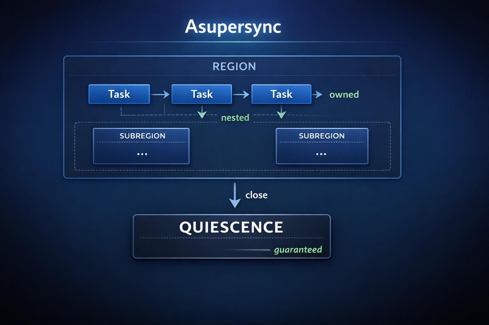

<p align="center">
  
</p>

# Asupersync

<div align="center">



[](https://github.com/Dicklesworthstone/asupersync/actions/workflows/ci.yml)
[](./LICENSE)
[](https://www.rust-lang.org/)
[](https://github.com/Dicklesworthstone/asupersync)

**Spec-first, cancel-correct, capability-secure async for Rust**

<h3>Quick Install</h3>

```bash
cargo add asupersync --git https://github.com/Dicklesworthstone/asupersync
```

</div>

---

## TL;DR

**The Problem**: Rust's async ecosystem gives you *tools* but not *guarantees*. Cancellation silently drops data. Spawned tasks can orphan. Cleanup is best-effort. Testing concurrent code is non-deterministic. You write correct code by convention, and discover bugs in production.

**The Solution**: Asupersync is an async runtime where **correctness is structural, not conventional**. Tasks are owned by regions that close to quiescence. Cancellation is a protocol with bounded cleanup. Effects require capabilities. The lab runtime makes concurrency deterministic and replayable.

### Why Asupersync?

| Guarantee | What It Means |
|-----------|---------------|
| **No orphan tasks** | Every spawned task is owned by a region; region close waits for all children |
| **Cancel-correctness** | Cancellation is request → drain → finalize, never silent data loss |
| **Bounded cleanup** | Cleanup budgets are *sufficient conditions*, not hopes |
| **No silent drops** | Two-phase effects (reserve/commit) make data loss impossible for primitives |
| **Deterministic testing** | Lab runtime: virtual time, deterministic scheduling, trace replay |
| **Adaptive preemption fairness** | Deterministic EXP3/Hedge policy tunes cancel streak limits with regret-bounded updates |
| **Drain progress certificates** | Variance-adaptive Azuma/Freedman bounds classify drain phase and confidence to quiescence |
| **Spectral early warnings** | Wait-graph spectral monitor combines conformal bounds and anytime-valid evidence |
| **Capability security** | All effects flow through explicit `Cx`; no ambient authority |

---

## Quick Example

```rust
use asupersync::{Cx, Scope, Outcome, Budget};

// Structured concurrency: scope guarantees quiescence
async fn main_task(cx: &mut Cx) -> Outcome<(), Error> {
    cx.region(|scope| async {
        // Spawn owned tasks - they cannot orphan
        scope.spawn(worker_a);
        scope.spawn(worker_b);

        // When scope exits: waits for BOTH tasks,
        // runs finalizers, resolves obligations
    }).await;

    // Guaranteed: nothing from inside is still running
    Outcome::ok(())
}

// Cancellation is a protocol, not a flag
async fn worker_a(cx: &mut Cx) -> Outcome<(), Error> {
    loop {
        // Checkpoint for cancellation - explicit, not implicit
        cx.checkpoint()?;

        // Two-phase send: cancel-safe
        let permit = tx.reserve(cx).await?;  // Can cancel here
        permit.send(message);                 // Linear: must happen
    }
}

// Lab runtime: deterministic testing
#[test]
fn test_cancellation_is_bounded() {
    let lab = LabRuntime::new(LabConfig::default().seed(42));

    lab.run(|cx| async {
        // Same seed = same execution = reproducible bugs
        cx.region(|scope| async {
            scope.spawn(task_under_test);
        }).await
    });

    // Oracles verify invariants
    assert!(lab.obligation_leak_oracle().is_ok());
    assert!(lab.quiescence_oracle().is_ok());
}
```

---

## Coming from tokio?

If you already know tokio, this section maps the primitives you use daily to their asupersync equivalents. The APIs are intentionally different -- asupersync trades implicit convenience for explicit cancel-correctness -- but the concepts map cleanly.

### Concept Mapping

| tokio | asupersync | Key difference |
|-------|-----------|----------------|
| `tokio::spawn(fut)` | `scope.spawn(&mut state, &cx, \|cx\| fut)` | Task is owned by a region; cannot orphan. Factory receives its own `Cx`. |
| `JoinHandle<T>` | `TaskHandle<T>` | `.join(&cx).await` returns `Result<T, JoinError>`. JoinError is Cancelled or Panicked. |
| `tokio::spawn_blocking(f)` | `spawn_blocking(f)` | Same idea. Runs closure on a blocking pool thread. |
| `tokio::select!` | `Select::new(a, b).await` | Returns `Either::Left(a)` / `Either::Right(b)`. Futures must be `Unpin`. Use `Scope::race` for auto-drain of losers. |
| `tokio::join!` | `scope.join_all(cx, futs).await` | All branches always complete (no abandonment). Outcomes aggregate via severity lattice. |
| `tokio::time::sleep(dur)` | `sleep(now, dur)` | Takes current `Time` instead of reading the clock implicitly. Works with virtual time in lab runtime. |
| `tokio::time::timeout(dur, fut)` | `timeout(now, dur, fut)` | Returns `Result<T, Elapsed>`. Also see the `Timeout` combinator type for richer outcome handling. |
| `tokio::time::interval(dur)` | `interval(now, dur)` | Same `MissedTickBehavior` options (Burst, Delay, Skip). |
| `tokio::sync::mpsc::channel(n)` | `mpsc::channel::<T>(n)` | Two-phase send: `tx.reserve(&cx).await?.send(val)`. Reserve is cancel-safe; commit cannot fail. |
| `tokio::sync::oneshot::channel()` | `oneshot::channel::<T>()` | Two-phase: `tx.reserve(&cx)` then `permit.send(val)`. |
| `tokio::sync::broadcast::channel(n)` | `broadcast::channel::<T>(n)` | Two-phase send. Lagging receivers get `RecvError::Lagged`. |
| `tokio::sync::watch::channel(init)` | `watch::channel(init)` | `rx.changed(&cx).await?` then `rx.borrow_and_clone()`. |
| `tokio::sync::Mutex` | `sync::Mutex` | `mutex.lock(&cx).await?` -- takes `&Cx`, returns `Result` (can be cancelled). |
| `tokio::sync::RwLock` | `sync::RwLock` | `.read(&cx).await?` / `.write(&cx).await?`. Writer-preference fairness. |
| `tokio::sync::Semaphore` | `sync::Semaphore` | `sem.acquire(&cx, n).await?`. Permit is an obligation released on drop. |
| `tokio::sync::Barrier` | `sync::Barrier` | `barrier.wait(&cx).await?`. Leader election built in (`is_leader`). |
| `tokio::sync::Notify` | `sync::Notify` | `notify.notified().await` / `notify.notify_one()` / `notify.notify_waiters()`. |
| `tokio::sync::OnceCell` | `sync::OnceCell` | `cell.get_or_init(async { ... }).await`. Cancel-safe: failed init lets next caller retry. |
| `tokio::task::yield_now()` | `yield_now()` | Identical concept -- yields to the scheduler. |

### Three things that will surprise you

**1. Every async operation takes `&Cx`.**
Where tokio reads ambient runtime state from thread-locals, asupersync passes an explicit capability context. This means cancellation and budgets compose structurally -- you can see exactly what a function can do from its signature.

```rust
// tokio
let permit = tx.reserve().await?;

// asupersync
let permit = tx.reserve(&cx).await?;
```

**2. No orphan tasks. Scopes close to quiescence.**
In tokio, `tokio::spawn` returns a detached task. In asupersync, every task lives in a region. When a scope exits, it waits for all children to finish. No fire-and-forget, no zombie tasks.

**3. `Outcome` instead of just `Result`.**
Tokio task results are `Result<T, JoinError>` where JoinError covers panics and cancellation. Asupersync uses a four-valued `Outcome<T, E>` that distinguishes `Ok`, `Err`, `Cancelled(reason)`, and `Panicked(payload)`. The severity lattice (`Ok < Err < Cancelled < Panicked`) drives how combinators aggregate results.

### Quick example: tokio vs asupersync

**tokio:**

```rust
use tokio::sync::mpsc;
use tokio::time::{sleep, Duration};

#[tokio::main]
async fn main() {
    let (tx, mut rx) = mpsc::channel(10);

    tokio::spawn(async move {
        for i in 0..5 {
            tx.send(i).await.unwrap();
            sleep(Duration::from_millis(100)).await;
        }
    });

    while let Some(val) = rx.recv().await {
        println!("got: {val}");
    }
}
```

**asupersync:**

```rust
use asupersync::channel::mpsc;
use asupersync::time::sleep;
use std::time::Duration;

async fn run(cx: &Cx, scope: &Scope) {
    let (tx, mut rx) = mpsc::channel::<i32>(10);

    scope.spawn(&mut state, cx, move |cx| async move {
        for i in 0..5 {
            let permit = tx.reserve(&cx).await.unwrap(); // cancel-safe
            permit.send(i);                               // cannot fail
            sleep(cx.now(), Duration::from_millis(100)).await;
        }
    });

    while let Ok(val) = rx.recv(&cx).await {
        println!("got: {val}");
    }
}
```

The key differences: `reserve`/`send` two-phase pattern prevents message loss on cancellation, `&cx` threads through capabilities, and the task is owned by the scope rather than detached.

---

## Design Philosophy

### 1. Structured Concurrency by Construction

Tasks don't float free. Every task is owned by a region. Regions form a tree. When a region closes, it *guarantees* all children are complete, all finalizers have run, all obligations are resolved. This is the "no orphans" invariant, enforced by the type system and runtime rather than by discipline.

```rust
// Typical executors: what happens when this scope exits?
spawn(async { /* orphaned? cancelled? who knows */ });

// Asupersync: scope guarantees quiescence
scope.region(|sub| async {
    sub.spawn(task_a);
    sub.spawn(task_b);
}).await;
// ← guaranteed: nothing from inside is still running
```

### 2. Cancellation as a First-Class Protocol

Cancellation operates as a multi-phase protocol, not a silent `drop`:

```
Running → CancelRequested → Cancelling → Finalizing → Completed(Cancelled)
            ↓                    ↓             ↓
         (bounded)          (cleanup)    (finalizers)
```

- **Request**: propagates down the tree
- **Drain**: tasks run to cleanup points (bounded by budgets)
- **Finalize**: finalizers run (masked, budgeted)
- **Complete**: outcome is `Cancelled(reason)`

Primitives publish *cancellation responsiveness bounds*. Budgets are sufficient conditions for completion.

Cancellation progress is continuously certifiable. `ProgressCertificate` tracks potential descent, classifies the current drain regime (`warmup`, `rapid_drain`, `slow_tail`, `stalled`, `quiescent`), and emits variance-adaptive concentration bounds (Freedman with Azuma as a conservative baseline). This turns "is shutdown actually converging?" into a measurable claim instead of a guess.

### 3. Two-Phase Effects Prevent Data Loss

Anywhere cancellation could lose data, Asupersync uses reserve/commit:

```rust
let permit = tx.reserve(cx).await?;  // ← cancel-safe: nothing committed yet
permit.send(message);                 // ← linear: must happen or abort
```

Dropping a permit aborts cleanly. Message never partially sent.

### 4. Capability Security (No Ambient Authority)

All effects flow through explicit capability tokens:

```rust
async fn my_task(cx: &mut Cx) {
    cx.spawn(...);        // ← need spawn capability
    cx.sleep_until(...);  // ← need time capability
    cx.trace(...);        // ← need trace capability
}
```

Swap `Cx` to change interpretation: production vs. lab vs. distributed.

### 5. Deterministic Testing is Default

The lab runtime provides:
- **Virtual time**: sleeps complete instantly, time is controlled
- **Deterministic scheduling**: same seed → same execution
- **Trace capture/replay**: debug production issues locally
- **Schedule exploration**: DPOR-class coverage of interleavings

Concurrency bugs become reproducible test failures.

---

## "Alien Artifact" Quality Algorithms

Asupersync deliberately uses mathematically rigorous machinery where it buys real correctness, determinism, and debuggability. The intent is to make concurrency properties *structural*, so both humans and coding agents can trust the system under cancellation, failures, and schedule perturbations.

### Formal Semantics (and a Lean Skeleton) for the Runtime Kernel

The runtime design is backed by a small-step operational semantics (`asupersync_v4_formal_semantics.md`) with an accompanying Lean mechanization scaffold (`formal/lean/Asupersync.lean`).

One example: the cancellation/cleanup **budget** composes as a semiring-like object (componentwise `min`, with priority as `max`), which makes "who constrains whom?" algebraic instead of ad-hoc:

```text
combine(b1, b2) =
  deadline   := min(b1.deadline,   b2.deadline)
  pollQuota  := min(b1.pollQuota,  b2.pollQuota)
  costQuota  := min(b1.costQuota,  b2.costQuota)
  priority   := max(b1.priority,   b2.priority)
```

This is the kind of structure that lets us reason about cancellation protocols and bounded cleanup with proof-friendly, compositional rules.

### Regret-Bounded Adaptive Cancel Preemption (Deterministic EXP3/Hedge)

Scheduler preemption is not fixed to one static cancel streak limit. Workers can run a deterministic EXP3/Hedge-style policy over a bounded set of candidate limits (for example, `{4, 8, 16, 32}`), then update weights at fixed epoch boundaries from observed reward (Lyapunov decrease + fairness + deadline pressure):

```text
p_t(a) = (1 - γ) * w_t(a)/Σ_b w_t(b) + γ/K
w_{t+1}(a) = w_t(a) * exp((γ / K) * r̂_t(a))
```

with importance-weighted reward `r̂_t(a_t) = r_t / p_t(a_t)` for the selected action.

Why it helps: cancel-heavy workloads and latency-heavy workloads need different preemption pressure. This controller adapts online while preserving deterministic replay semantics and bounded starvation envelopes.

### Variance-Adaptive Drain Certificates (Azuma + Freedman + Phase Classification)

Cancellation drain progress is monitored as a martingale-style certificate over potential deltas. The runtime reports both a worst-case Azuma bound and a variance-adaptive Freedman bound:

```text
P(M_t - M_0 ≥ x) ≤ exp(-x² / (2(V_t + c x / 3)))
```

where `V_t` is predictable variation and `c` bounds one-step increments.

The same monitor classifies operational drain regime (`warmup`, `rapid_drain`, `slow_tail`, `stalled`, `quiescent`) so operators can distinguish "normal long tail" from "true stall".

Why it helps: shutdown and fail-fast behavior can be audited with explicit confidence numbers and phase labels, instead of timeout heuristics.

### Spectral Wait-Graph Early Warning (Cheeger/Fiedler + Conformal + E-Process)

Asupersync treats the task wait-for graph as a dynamic signal. The monitor tracks the Fiedler trajectory (algebraic connectivity), spectral gap/radius, and a nonparametric indicator stack (autocorrelation, variance ratio, flicker, skewness, Kendall tau, Spearman rho, Hoeffding's D, distance correlation), then calibrates forward risk with split conformal bounds and an anytime-valid deterioration e-process.

Why it helps: structural degradation is detected before hard deadlock/disconnect events, with calibrated thresholds and continuously valid evidence rather than brittle one-off alarms.

### DPOR-Style Schedule Exploration (Mazurkiewicz Traces, Foata Fingerprints)

The Lab runtime includes a DPOR-style schedule explorer (`src/lab/explorer.rs`) that treats executions as traces modulo commutation of independent events (Mazurkiewicz equivalence). Instead of "run it 10,000 times and pray", it tracks coverage by equivalence class fingerprints and can prioritize exploration based on trace topology.

Result: deterministic, replayable concurrency debugging with *coverage semantics* rather than vibes.

### Anytime-Valid Invariant Monitoring via e-processes

Oracles can run repeatedly during an execution without invalidating significance, using **e-processes** (`src/lab/oracle/eprocess.rs`). The key property is Ville's inequality (anytime validity):

```text
P_H0(∃ t : E_t ≥ 1/α) ≤ α
```

So you can "peek" after every scheduling step and still control type-I error, which is exactly what you want in a deterministic scheduler + oracle setting.

### Distribution-Free Conformal Calibration for Lab Metrics

For lab metrics that benefit from calibrated prediction sets, Asupersync uses split conformal calibration (`src/lab/conformal.rs`) with finite-sample, distribution-free guarantees (under exchangeability):

```text
P(Y ∈ C(X)) ≥ 1 − α
```

This is used to keep alerting and invariant diagnostics robust without baking in fragile distributional assumptions.

### Explainable Evidence Ledgers (Bayes Factors, Galaxy-Brain Diagnostics)

When a run violates an invariant (or conspicuously does not), Asupersync can produce a structured evidence ledger (`src/lab/oracle/evidence.rs`) using Bayes factors and log-likelihood contributions. This enables agent-friendly debugging: equations, substitutions, and one-line intuitions, so you can see *exactly why* the system believes "task leak" (or "clean close") is happening.

### Deterministic Algorithms in the Hot Path (Not Just in Tests)

Determinism is treated as a first-class algorithmic constraint across the codebase:

- A deterministic virtual time wheel (`src/lab/virtual_time_wheel.rs`) with explicit tie-breaking.
- Deterministic consistent hashing (`src/distributed/consistent_hash.rs`) for stable assignment without iteration-order landmines.
- Trace canonicalization and race analysis hooks integrated into the lab runtime (`src/lab/runtime.rs`, `src/trace/dpor`).

"Same seed, same behavior" holds end-to-end, not just for a demo scheduler.

---

## How Asupersync Compares

| Feature | Asupersync | async-std | smol |
|---------|------------|-----------|------|
| **Structured concurrency** | ✅ Enforced | ❌ Manual | ❌ Manual |
| **Cancel-correctness** | ✅ Protocol | ⚠️ Drop-based | ⚠️ Drop-based |
| **No orphan tasks** | ✅ Guaranteed | ❌ spawn detaches | ❌ spawn detaches |
| **Bounded cleanup** | ✅ Budgeted | ❌ Best-effort | ❌ Best-effort |
| **Deterministic testing** | ✅ Built-in | ❌ External tools | ❌ External tools |
| **Obligation tracking** | ✅ Linear tokens | ❌ None | ❌ None |
| **Ecosystem** | ✅ Tokio-scale built-in surface (runtime, net, HTTP/1.1+H2, TLS, WebSocket, gRPC, DB, distributed) | ⚠️ Medium | ⚠️ Small |
| **Maturity** | ✅ Feature-complete runtime surface, actively hardened | ✅ Production | ✅ Production |

**When to use Asupersync:**
- Systems that want a broad, integrated async stack without pulling in Tokio
- Systems where cancel-correctness is non-negotiable (financial, medical, infrastructure)
- Projects that need deterministic concurrency testing
- Distributed systems with structured shutdown requirements

**When to consider alternatives:**
- You need strict drop-in compatibility with libraries that are hard-wired to Tokio runtime traits
- Rapid prototyping where correctness guarantees aren't yet critical

## Tokio Ecosystem Coverage Map

The table above compares runtimes. This section compares ecosystem surface area.
It maps common Tokio ecosystem crates to the corresponding Asupersync modules.

| Ecosystem Area | Typical Tokio Crates | Asupersync Surface | Parity status | Maturity | Determinism | Interop friction |
|----------------|----------------------|--------------------|---------------|----------|-------------|------------------|
| Core runtime + task execution | `tokio` | `src/runtime/`, `src/cx/`, `src/record/` | Built-in | Mature | Lab-strong | High |
| Structured concurrency + cancellation protocol | usually ad hoc on Tokio | Built into `Cx`, regions, obligations (`src/cx/`, `src/cancel/`, `src/obligation/`) | Built-in | Mature | Strong | High |
| Channels | `tokio::sync::{mpsc, oneshot, broadcast, watch}` | `src/channel/{mpsc,oneshot,broadcast,watch}.rs` | Built-in | Mature | Lab-strong | Medium |
| Sync primitives | `tokio::sync::{Mutex,RwLock,Semaphore,Notify,Barrier,OnceCell}` | `src/sync/` | Built-in | Mature | Lab-strong | Medium |
| Time and timers | `tokio::time` | `src/time/`, `src/runtime/timer*`, `src/lab/virtual_time_wheel.rs` | Built-in | Mature | Lab-strong | Medium |
| Async I/O traits and extensions | `tokio::io`, `tokio-util::io` | `src/io/` | Built-in | Active | Mixed | Medium |
| Codec/framing layer | `tokio-util::codec` | `src/codec/` | Built-in | Active | Mixed | Medium |
| Byte buffers | `bytes` | `src/bytes/` | Built-in | Mature | N/A | Low |
| Reactor backends | Tokio + Mio internals | `src/runtime/reactor/{epoll,kqueue,windows,lab}.rs` (+ `io_uring` feature on Linux) | Built-in | Active | Mixed | Medium |
| TCP/UDP/Unix sockets | `tokio::net` | `src/net/tcp/`, `src/net/udp.rs`, `src/net/unix/` | Built-in | Active | Mixed | Medium |
| DNS resolution | `trust-dns`, `hickory`, custom stacks | `src/net/dns/` | Built-in | Active | Mixed | Medium |
| TLS | `tokio-rustls`, `native-tls` | `src/tls/` (`tls`, `tls-native-roots`, `tls-webpki-roots`) | Feature-gated | Active | Mixed | Medium |
| WebSocket | `tokio-tungstenite` | `src/net/websocket/` | Built-in | Active | Mixed | Medium |
| HTTP stack (HTTP/1.1 + HTTP/2) | `hyper`, `h2`, `http-body`, `hyper-util` | `src/http/h1/`, `src/http/h2/`, `src/http/body.rs`, `src/http/pool.rs` | Built-in | Active | Mixed | Medium |
| QUIC + HTTP/3 | `quinn`, `h3`, `h3-quinn` | `src/net/quic_core/`, `src/net/quic_native/`, `src/http/h3_native.rs` (native feature surfaces exposed via `quic`/`http3`; legacy wrappers remain parked under `quic-compat`/`http3-compat`) | In progress | Active | Mixed | High |
| Web framework | `axum`, `warp`, `tower-http` | `src/web/`, `src/service/`, `src/server/` | In progress | Active | Mixed | Medium |
| gRPC | `tonic` + `prost` + `tower` + `hyper` | `src/grpc/` | Built-in | Active | Mixed | Medium |
| Database clients | `tokio-postgres`, `mysql_async`, `sqlx` | `src/database/{postgres,mysql,sqlite}.rs` | Feature-gated | Active | Mixed | Medium |
| Messaging clients | async Redis/NATS/Kafka crates | `src/messaging/{redis,nats,kafka}.rs` | In progress | Early | Mixed | Medium |
| Service/middleware stack | `tower`, `tower-layer`, `tower-service` | `src/service/` + optional `tower` adapter feature | Built-in | Active | Lab-strong | Low |
| Filesystem APIs | `tokio::fs` | `src/fs/` | In progress | Early | Mixed | Medium |
| Process management | `tokio::process` | `src/process.rs` | Built-in | Active | Mixed | Medium |
| Signals | `tokio::signal` | `src/signal/` | Built-in | Active | Mixed | Medium |
| Streams and adapters | `tokio-stream`, `futures-util::stream` | `src/stream/` | Built-in | Active | Lab-strong | Low |
| Observability | `tracing`, `metrics`, `opentelemetry` | `src/observability/`, `src/tracing_compat.rs` | Built-in + feature-gated integrations | Active | Mixed | Low |
| Deterministic concurrency testing | `loom`, `tokio-test`, external harnesses | `src/lab/`, `frankenlab/`, optional `loom-tests` feature | Built-in | Mature | Strong | Low |
| Tokio-locked third-party crates | crates that require Tokio runtime traits directly | boundary adapters via service/runtime integration points | Adapter needed | N/A | N/A | High |

This map is about capability coverage, not API compatibility. Asupersync intentionally uses a different model centered on `Cx`, regions, explicit cancellation, and deterministic replay.

---

## Installation

### From Git (Recommended)

```bash
# Add to Cargo.toml
cargo add asupersync --git https://github.com/Dicklesworthstone/asupersync

# Or manually add:
# [dependencies]
# asupersync = { git = "https://github.com/Dicklesworthstone/asupersync" }
```

### From Source

```bash
git clone https://github.com/Dicklesworthstone/asupersync.git
cd asupersync
cargo build --release
```

### Minimum Supported Rust Version

Asupersync uses **Rust Edition 2024** and tracks the pinned **nightly** toolchain in `rust-toolchain.toml`.

---

## Core Types Reference

### Outcome — Four-Valued Result

```rust
pub enum Outcome<T, E> {
    Ok(T),                    // Success
    Err(E),                   // Application error
    Cancelled(CancelReason),  // External cancellation
    Panicked(PanicPayload),   // Task panicked
}

// Severity lattice: Ok < Err < Cancelled < Panicked
// HTTP mapping: Ok→200, Err→4xx/5xx, Cancelled→499, Panicked→500
```

### Budget — Resource Constraints

```rust
pub struct Budget {
    pub deadline: Option<Time>,   // Absolute deadline
    pub poll_quota: u32,          // Max poll calls
    pub cost_quota: Option<u64>,  // Abstract cost units
    pub priority: u8,             // Scheduling priority (0-255)
}

// Semiring: meet(a, b) = tighter constraint wins
let effective = outer_budget.meet(inner_budget);
```

### CancelReason — Structured Context

```rust
pub enum CancelKind {
    User,             // Explicit cancellation
    Timeout,          // Deadline exceeded
    FailFast,         // Sibling failed
    RaceLost,         // Lost a race
    ParentCancelled,  // Parent region cancelled
    Shutdown,         // Runtime shutdown
}

// Severity: User < Timeout < FailFast < ParentCancelled < Shutdown
// Cleanup budgets scale inversely with severity
```

### Cx — Capability Context

```rust
pub struct Cx { /* ... */ }

impl Cx {
    pub fn spawn<F>(&self, f: F) -> TaskHandle;
    pub fn checkpoint(&self) -> Result<(), Cancelled>;
    pub fn mask(&self) -> MaskGuard;  // Defer cancellation
    pub fn trace(&self, event: TraceEvent);
    pub fn budget(&self) -> Budget;
    pub fn is_cancel_requested(&self) -> bool;
}
```

---

## Architecture

```
┌─────────────────────────────────────────────────────────────────────────────┐
│                               EXECUTION TIERS                               │
├─────────────────────────────────────────────────────────────────────────────┤
│                                                                             │
│  ┌───────────────┐  ┌───────────────┐  ┌───────────────┐  ┌───────────────┐ │
│  │    FIBERS     │  │     TASKS     │  │    ACTORS     │  │    REMOTE     │ │
│  │               │  │               │  │               │  │               │ │
│  │• Borrow-safe  │  │• Parallel     │  │• Long-lived   │  │• Named compute│ │
│  │• Same-thread  │  │• Send         │  │• Supervised   │  │• Leases       │ │
│  │• Region-pinned│  │• Work-stealing│  │• Region-owned │  │• Idempotent   │ │
│  │• Cancel-safe  │  │• Region-heap  │  │• Mailbox      │  │• Saga cleanup │ │
│  └───────────────┘  └───────────────┘  └───────────────┘  └───────────────┘ │
│          │                  │                  │                  │         │
│          └──────────────────┴────────┬─────────┴──────────────────┘         │
│                                      │                                      │
│                                      ▼                                      │
│  ┌─────────────────────────────────────────────────────────────────────┐   │
│  │                             REGION TREE                             │   │
│  │                                                                     │   │
│  │    Root Region ──┬── Child Region ──┬── Task                        │   │
│  │                  │                  ├── Task                        │   │
│  │                  │                  └── Subregion ── Task           │   │
│  │                  └── Child Region ── Actor                          │   │
│  │                                                                     │   │
│  │    Invariant: close(region) → quiescence(all descendants)           │   │
│  │                                                                     │   │
│  └─────────────────────────────────────────────────────────────────────┘   │
│                                      │                                      │
│                                      ▼                                      │
│  ┌─────────────────────────────────────────────────────────────────────┐   │
│  │                         OBLIGATION REGISTRY                         │   │
│  │                                                                     │   │
│  │    SendPermit ──→ send() or abort()                                 │   │
│  │    Ack        ──→ commit() or nack()                                │   │
│  │    Lease      ──→ renew() or expire()                               │   │
│  │    IoOp       ──→ complete() or cancel()                            │   │
│  │                                                                     │   │
│  │    Invariant: region_close requires all obligations resolved        │   │
│  │                                                                     │   │
│  └─────────────────────────────────────────────────────────────────────┘   │
│                                      │                                      │
│                                      ▼                                      │
│  ┌─────────────────────────────────────────────────────────────────────┐   │
│  │                              SCHEDULER                              │   │
│  │                                                                     │   │
│  │    Cancel Lane ──→ Timed Lane (EDF) ──→ Ready Lane                  │   │
│  │         ↑                                                           │   │
│  │    (priority)     Lyapunov-guided: V(Σ) must decrease               │   │
│  │                                                                     │   │
│  └─────────────────────────────────────────────────────────────────────┘   │
│                                                                             │
└─────────────────────────────────────────────────────────────────────────────┘
```

### Scheduler Priority Lanes

| Lane | Purpose | Priority |
|------|---------|----------|
| **Cancel Lane** | Tasks in cancellation states | 200-255 (highest) |
| **Timed Lane** | Deadline-driven tasks (EDF) | Based on deadline |
| **Ready Lane** | Normal runnable tasks | Default priority |

Scheduler behavior is intentionally explicit:

- Cancel preemption is bounded, not unbounded. With the default `cancel_streak_limit=16`, ready or timed work gets a dispatch slot within `limit + 1` steps per worker (`src/runtime/scheduler/three_lane.rs`).
- During `DrainObligations` and `DrainRegions`, the effective bound is temporarily widened to `2 * cancel_streak_limit` to finish cleanup without starving everything else (`src/runtime/scheduler/three_lane.rs`).
- Workers track fairness telemetry (`fairness_yields`, `max_cancel_streak`) so starvation claims can be checked against runtime counters, not guesses (`src/runtime/scheduler/three_lane.rs`).
- Local dispatch uses single-lock multi-lane pops (`try_local_any_lane` and `pop_any_lane_with_hint`) to reduce lock traffic on the hot path while keeping lane ordering rules intact (`src/runtime/scheduler/three_lane.rs`).
- An optional Lyapunov governor can steer lane ordering from periodic runtime snapshots. It is off by default, and when enabled it runs at a configurable interval (`governor_interval`, default `32`) (`src/runtime/config.rs`, `src/runtime/builder.rs`, `src/runtime/scheduler/three_lane.rs`).
- Adaptive cancel preemption is available as a deterministic no-regret online controller: workers run an EXP3/Hedge-style policy over candidate cancel-streak limits, updating from reward signals that blend Lyapunov decrease, fairness pressure, and deadline pressure (`src/runtime/scheduler/three_lane.rs`, `src/runtime/config.rs`, `src/runtime/builder.rs`).
- When governor mode is enabled, scheduling suggestions can be modulated by a decision contract with Bayesian posterior updates over `healthy`, `congested`, `unstable`, and `partitioned` runtime states (`src/runtime/scheduler/decision_contract.rs`, `src/runtime/scheduler/three_lane.rs`).
- Dispatch follows an explicit multi-phase path: global lanes, fast ready paths, one local-lane lock acquisition, steal attempts, then fallback cancel handling (`src/runtime/scheduler/three_lane.rs`).
- Worker wakeups are coordinated through round-robin targeted unparks, with a bitmask fast path when worker count is a power of two (`src/runtime/scheduler/three_lane.rs`).
- I/O polling uses a leader/follower turn: the worker that acquires the I/O driver lock runs the reactor turn while peers continue scheduling (`src/runtime/scheduler/three_lane.rs`).
- Local `!Send` tasks are pinned to owner workers and routed through non-stealable queues; steal paths explicitly reject moving them across workers (`src/runtime/scheduler/three_lane.rs`, `src/runtime/scheduler/local_queue.rs`).
- Local queue discipline is asymmetric on purpose: owner operations are LIFO for cache locality, while thief operations are FIFO to keep stolen work older and reduce starvation pressure (`src/runtime/scheduler/local_queue.rs`).
- Idle-worker parking uses a permit-style `Parker` and explicit queue rechecks after wakeups, which closes lost-wakeup races between work injection and parking (`src/runtime/scheduler/worker.rs`, `src/runtime/scheduler/three_lane.rs`).

### Sharded Runtime State and Lock Discipline

Runtime state is split into independently locked shards so hot-path polling can proceed without serializing every region or obligation mutation.

- Shard A (`tasks`): task table, stored futures, intrusive queue links.
- Shard B (`regions`): region ownership tree and state transitions.
- Shard C (`obligations`): permit/ack/lease lifecycle and leak tracking.
- Shard D (`instrumentation`): trace and metrics surfaces.
- Shard E (`config`): immutable runtime config.

Multi-shard operations use `ShardGuard` with canonical acquisition order `E -> D -> B -> A -> C`, and debug checks enforce that order to prevent deadlocks (`src/runtime/sharded_state.rs`). Shard locks are `ContendedMutex` instances, and optional `lock-metrics` instrumentation can measure wait/hold behavior (`src/sync/contended_mutex.rs`).

### Region Heap Handles and Quiescent Reclamation

Region memory uses stable handles (`HeapIndex`) with slot index, generation, and type tag metadata instead of exposing raw allocation addresses.

- Generation increments on slot reuse, so stale handles fail closed and ABA-style reuse bugs are blocked (`src/runtime/region_heap.rs`).
- Reuse order is deterministic for identical allocation/deallocation sequences, which keeps trace behavior stable across runs (`src/runtime/region_heap.rs`).
- Heap reclamation is wired to region close/quiescence, not opportunistic frees, and stats track live vs. reclaimed objects for runtime auditing (`src/runtime/region_heap.rs`).

### Runtime Control Surfaces: Causal Time, Cancel Attribution, and Deadline Signals

Asupersync exposes runtime controls that are usually hidden behind ad hoc instrumentation. These controls are wired into scheduler and trace behavior directly.

| Control | API | Runtime Behavior |
|---------|-----|------------------|
| Logical clock mode | `RuntimeBuilder::logical_clock_mode(...)` | Select Lamport, Vector, or Hybrid logical clocks for causal ordering; defaults are chosen from runtime context and carried into event timelines (`src/runtime/config.rs`, `src/trace/distributed/vclock.rs`, `src/runtime/state.rs`) |
| Cancel attribution bounds | `RuntimeBuilder::cancel_attribution_config(...)` | Bound cancellation cause-chain depth and memory while preserving root-cause lineage and explicit truncation metadata when limits are hit (`src/types/cancel.rs`, `src/runtime/state.rs`) |
| Deadline monitor | `RuntimeBuilder::deadline_monitoring(...)` | Run a background monitor with configurable check cadence, warning thresholds, adaptive history percentiles, and custom warning callbacks (`src/runtime/deadline_monitor.rs`, `src/runtime/builder.rs`) |

- Deadline checks are logical-time aware and fall back to wall-clock progression when logical time is stable, so stalled-task warnings work in both lab and production-style runs (`src/runtime/deadline_monitor.rs`).
- Warning emission is per-task deduplicated until task removal, so deadline diagnostics stay high-signal under repeated scans (`src/runtime/deadline_monitor.rs`).
- Deadline warnings carry the most recent checkpoint message when available, which makes stalled-task alerts actionable without digging through a full trace first (`src/runtime/deadline_monitor.rs`).

## How We Made It Fast

This runtime got fast through many small, verified runtime changes by the project owner and collaborating coding agents. The method stayed consistent: profile the hot paths, remove one source of contention or allocation at a time, then keep cancellation and determinism guarantees intact.

- **Scheduler lock traffic**: dispatch uses a multi-phase path, and local cancel/timed/ready checks run under one local lock acquisition instead of repeated lock round-trips (`src/runtime/scheduler/three_lane.rs`).
- **Hot-path task isolation**: scheduler queues can run against a dedicated sharded `TaskTable`, so push/pop/steal paths avoid full runtime-state lock pressure (`src/runtime/task_table.rs`, `src/runtime/scheduler/local_queue.rs`, `src/runtime/scheduler/three_lane.rs`).
- **Targeted wake coordination**: worker wakeups go through a coordinator with round-robin unparks and a power-of-two bitmask fast path, so wake selection avoids heavier arithmetic in steady state (`src/runtime/scheduler/three_lane.rs`).
- **Centralized wake dedup**: scheduling paths route through `wake_state.notify()` with an explicit `Idle -> Polling -> Notified` state machine, so wakes that arrive during poll are coalesced once instead of double-enqueueing (`src/record/task.rs`, `src/runtime/scheduler/three_lane.rs`, `src/runtime/scheduler/worker.rs`).
- **Cheaper wake bookkeeping**: waiter registration paths use `Waker::will_wake` guards to skip redundant clones and refresh only when the executor context actually changes (`src/transport/sink.rs`, `src/transport/mock.rs`).
- **Lost-wakeup hardening without busy spin**: parking uses permit-style semantics, and queue/capacity rechecks close races between waiter registration and wakeups (`src/runtime/scheduler/worker.rs`, `src/runtime/scheduler/three_lane.rs`, `src/transport/sink.rs`).
- **Allocation pressure reduction**: hot paths moved away from per-dispatch temporary `Vec` usage toward `SmallVec` and pre-sized structures (`src/runtime/scheduler/three_lane.rs`, `src/transport/router.rs`, `src/transport/aggregator.rs`).
- **Intrusive queue hot paths**: local ready/cancel queues store links directly in `TaskRecord` with queue-tag membership checks, so owner pop and thief steal stay O(1) without per-operation node allocation (`src/runtime/scheduler/intrusive.rs`, `src/runtime/scheduler/local_queue.rs`).
- **Lower mutex overhead across the stack**: runtime, scheduler, I/O, lab, networking, and transport internals were migrated to `parking_lot` primitives where it improves lock-path cost (`src/runtime/*`, `src/transport/*`, `src/lab/*`).
- **Atomic and counter-path tuning**: the global injector increments timed counters before heap insert, uses saturating decrements on pop, and keeps a cached earliest-deadline fast path so workers can usually skip timed-lane mutex acquisition (`src/runtime/scheduler/global_injector.rs`).
- **Steal-path locality shortcuts**: local queues track whether any pinned local tasks are present; when none are present, stealers take a no-branch non-local path, and when locals do exist they are skipped/restored with `SmallVec` to keep the common path allocation-free (`src/runtime/scheduler/local_queue.rs`, `src/runtime/scheduler/intrusive.rs`).
- **Backpressure without silent drops**: global ready-queue limits emit capacity warnings while still scheduling work, preserving structured-concurrency guarantees instead of dropping tasks (`src/runtime/scheduler/three_lane.rs`, `src/runtime/config.rs`).
- **Reactor fast paths**: I/O registration rearm paths cache waker state, and stale token/fd cleanup is explicit, which keeps event loops moving under churn (`src/runtime/io_driver.rs`, `src/runtime/reactor/*`).
- **Timer wheel tuned for real cancellation workloads**: timer cancel is generation-based O(1), long deadlines spill into overflow and are promoted back in range, and coalescing windows can batch nearby wakeups with minimum-group gating (`src/time/wheel.rs`, `src/time/driver.rs`).
- **Panic containment on worker threads**: task polling is guarded so panics are converted into terminal `Outcome::Panicked`, dependents/finalizers are still driven, and one bad task does not take down a worker lane (`src/runtime/scheduler/three_lane.rs`, `src/runtime/builder.rs`).
- **Timer behavior measured where it matters**: the timer benchmark corpus includes direct wheel-vs-`BTreeMap`/`BinaryHeap` comparisons, and the documented 10K corpus records a 2.67x cancel-path advantage over `BTreeMap` (`benches/timer_wheel.rs`).
- **Stable memory handles with deterministic reuse**: region-heap generation indices prevent ABA-style stale-handle reuse while preserving deterministic allocation/reuse patterns (`src/runtime/region_heap.rs`).
- **Continuous measurement**: the repository carries dedicated benchmark surfaces for scheduler, reactor, timer wheel, cancel/drain, and tracing overhead (`benches/scheduler_benchmark.rs`, `benches/reactor_benchmark.rs`, `benches/timer_wheel.rs`, `benches/cancel_drain_bench.rs`, `benches/tracing_overhead.rs`).

---

## Networking & Protocol Stack

Asupersync ships a cancel-safe networking stack from raw sockets through application protocols. Every layer participates in structured concurrency: reads and writes respect region budgets, cancellation drains connections cleanly, and the lab runtime can substitute virtual TCP for deterministic network testing.

Reactor and I/O paths are also hardened for long-lived production behavior:

- Registrations are RAII-backed and deregistration treats `NotFound` as already-cleaned state, so cancellation/drop races do not leak bookkeeping (`src/runtime/io_driver.rs`, `src/runtime/reactor/registration.rs`).
- Token slabs are generation-tagged, which blocks stale-token wakeups after slot reuse (`src/runtime/reactor/token.rs`).
- The I/O driver records `unknown_tokens` instead of panicking when stale/backend events appear, so diagnostics stay available under fault conditions (`src/runtime/io_driver.rs`).
- `epoll` interest mapping supports edge-triggered and edge-oneshot modes plus explicit PRIORITY/HUP/ERROR propagation, so readiness semantics are carried with fewer implicit assumptions (`src/runtime/reactor/epoll.rs`).
- `epoll` paths explicitly clean stale fd/token mappings on `ENOENT`/closed-fd conditions, including fd-reuse edge cases (`src/runtime/reactor/epoll.rs`).
- `io_uring` poll handles timeout expiry (`ETIME`) as a timeout condition, not an operational failure, and ignores stale completions for deregistered tokens (`src/runtime/reactor/io_uring.rs`).

### TCP

`src/net/tcp/` provides `TcpStream`, `TcpListener`, and split reader/writer halves. Connections are registered with the I/O reactor (epoll or io_uring) and use oneshot waker semantics: the reactor disarms interest after each readiness event, and the stream re-arms explicitly. This avoids spurious wakes at the cost of a `set_interest` call per poll cycle, which benchmarks show is negligible compared to syscall overhead.

A `VirtualTcp` implementation (`src/net/tcp/virtual_tcp.rs`) provides a fully in-memory TCP abstraction for lab-runtime tests. Same API surface, deterministic behavior, no kernel sockets.

### HTTP/1.1 and HTTP/2

`src/http/h1/` implements HTTP/1.1 with chunked transfer encoding, connection keep-alive, and streaming request/response bodies. `src/http/h2/` implements HTTP/2 frame parsing, HPACK header compression, flow control, and stream multiplexing over a single connection.

Both layers integrate with connection pooling (`src/http/pool.rs`) and optional response compression (`src/http/compress.rs`).

### WebSocket

`src/net/websocket/` implements RFC 6455: handshake, binary/text frames, ping/pong, and close frames with status codes. The split reader/writer model allows concurrent send and receive within the same region.

### TLS

`src/tls/` wraps `rustls` for TLS 1.2/1.3 with three feature flags:

| Flag | Root Certs |
|------|------------|
| `tls` | Bring your own |
| `tls-native-roots` | OS trust store |
| `tls-webpki-roots` | Mozilla's WebPKI bundle |

### DNS and UDP

`src/net/dns/` provides async DNS resolution with address-family selection. `src/net/udp.rs` provides async UDP sockets with send/receive and cancellation safety.

### Transport Routing and Multipath Delivery

`src/transport/` covers runtime-level delivery behavior above raw sockets and below protocol clients:

- `router.rs` tracks endpoint health and routing state with atomics (`EndpointState`, connection counters, failure counters) and uses RAII guards for active connection/dispatch accounting, including cancel/panic paths.
- `aggregator.rs` handles multipath symbol intake with dedup windows, reorder handling, and per-path statistics for loss/duplicate tracking.
- `sink.rs` and `stream.rs` use queued waiters with atomic flags and explicit wakeup bookkeeping to avoid lost-wakeup edge cases in bounded channel transport.
- `sink.rs` deduplicates waiter updates with `Waker::will_wake` checks and re-checks capacity after waiter registration, which closes the capacity-check/registration lost-wakeup race (`src/transport/sink.rs`).
- Shared channel close paths wake both send and receive waiters, so shutdown does not strand pending channel operations (`src/transport/mod.rs`).

---

## Database Integration

Asupersync includes async clients for three databases, each respecting structured concurrency and cancellation.

| Database | Location | Wire Protocol | Auth |
|----------|----------|---------------|------|
| **SQLite** | `src/database/sqlite.rs` | Blocking pool bridge | N/A |
| **PostgreSQL** | `src/database/postgres.rs` | Binary protocol v3 | SCRAM-SHA-256 |
| **MySQL** | `src/database/mysql.rs` | MySQL wire protocol | Native + caching_sha2 |

All three support prepared statements, transactions, and connection reuse. SQLite operations run on the blocking thread pool (since `rusqlite` is synchronous) with cancel-safe wrappers that respect region deadlines. PostgreSQL and MySQL implement their wire protocols directly over `TcpStream`, avoiding external driver dependencies.

### Blocking Pool Safety Semantics

`src/runtime/blocking_pool.rs` enforces several invariants that matter under cancellation and panic-heavy workloads:

- Thread expansion only happens when pending work exists and all active workers are busy.
- Idle retirement uses an atomic claim step that cannot retire below `min_threads`.
- Panicking blocking tasks are wrapped so completion signaling and busy-thread counters are still balanced.
- Failed thread spawns roll back active-thread accounting immediately.

---

## Remote Runtime and Distributed Coordination

Asupersync's distributed runtime primitives are designed around the same invariants as local execution: explicit ownership, explicit cancellation, and deterministic state transitions.

| Primitive | Location | Runtime Behavior |
|-----------|----------|------------------|
| Named remote spawn | `src/remote.rs` | `spawn_remote` executes named computations (no closure shipping) under `RemoteCap` |
| Lease obligations | `src/remote.rs` | Leases are obligation-backed and participate in region close/quiescence |
| Idempotency store | `src/remote.rs` | Deduplicates spawn retries with TTL-bounded records and conflict detection |
| Session-typed protocol | `src/remote.rs` | Origin/remote state machines validate legal spawn/ack/cancel/result/renewal transitions |
| Logical-time envelopes | `src/remote.rs` | Protocol messages carry logical clock metadata for causal correlation |
| Saga compensations | `src/remote.rs` | Forward steps and compensations are tracked as a structured rollback flow |

The transport surface is deliberately separated from protocol state machines, so message semantics can be tested independently of network backend details.

---

## Channels and Synchronization Primitives

### Channels

| Channel | Location | Pattern | Cancel-Safe |
|---------|----------|---------|-------------|
| **MPSC** | `src/channel/mpsc.rs` | Multi-producer, single-consumer | Two-phase send (reserve/commit) |
| **Oneshot** | `src/channel/oneshot.rs` | Single send, single receive | Two-phase send |
| **Broadcast** | `src/channel/broadcast.rs` | Fan-out to subscribers | Waiter cleanup on drop |
| **Watch** | `src/channel/watch.rs` | Last-value multicast | Always-current read |
| **Session** | `src/channel/session.rs` | Typed RPC with reply obligation | Reply is a linear resource |

The two-phase pattern (reserve a permit, then commit the send) is central to cancel-correctness. A reserved-but-uncommitted permit aborts cleanly on cancellation. A committed send is guaranteed delivered. No half-sent messages.

### Synchronization

| Primitive | Location | Notes |
|-----------|----------|-------|
| **Mutex** | `src/sync/mutex.rs` | Fair, cancel-safe, tracks contention |
| **RwLock** | `src/sync/rwlock.rs` | Writer preference with reader batching |
| **Semaphore** | `src/sync/semaphore.rs` | Counting, with permit-as-obligation model |
| **Barrier** | `src/sync/barrier.rs` | N-way synchronization point |
| **Notify** | `src/sync/notify.rs` | One-time or multi-waiter notification |
| **OnceLock** | `src/sync/once_cell.rs` | Async one-time initialization |
| **ContendedMutex** | `src/sync/contended_mutex.rs` | Mutex with contention metrics |
| **Pool** | `src/sync/pool.rs` | Object pool with per-thread caches |

All primitives are deterministic under the lab runtime and participate in futurelock detection.

---

## Concurrency Combinators

Beyond `join`, `race`, and `timeout`, the combinator library includes patterns for distributed systems and resilience:

| Combinator | Location | Purpose |
|------------|----------|---------|
| **quorum** | `src/combinator/quorum.rs` | M-of-N completion for consensus patterns |
| **hedge** | `src/combinator/hedge.rs` | Start backup after delay, first response wins |
| **first_ok** | `src/combinator/first_ok.rs` | Try operations sequentially until one succeeds |
| **pipeline** | `src/combinator/pipeline.rs` | Staged transformations with backpressure |
| **map_reduce** | `src/combinator/map_reduce.rs` | Parallel map + monoid reduction |
| **circuit_breaker** | `src/combinator/circuit_breaker.rs` | Failure detection, open/half-open/closed states |
| **bulkhead** | `src/combinator/bulkhead.rs` | Concurrency isolation (bounded parallelism) |
| **rate_limit** | `src/combinator/rate_limit.rs` | Token bucket throughput control |
| **bracket** | `src/combinator/bracket.rs` | Acquire/use/release with guaranteed cleanup |
| **retry** | `src/combinator/retry.rs` | Exponential backoff, budget-aware |

Every combinator is cancel-safe. Losers drain after races. Outcomes aggregate via the severity lattice. An explicit law sheet (`src/combinator/laws.rs`) documents algebraic properties (associativity, commutativity, distributivity) and a rewrite engine (`src/plan/rewrite.rs`) can optimize combinator DAGs while preserving cancel/drain/quiescence invariants.

---

## RaptorQ Fountain Coding

`src/raptorq/` implements RFC 6330 systematic RaptorQ codes, a fountain code where any K-of-N encoded symbols suffice to recover the original K source symbols. This underpins Asupersync's distributed snapshot distribution: region state is encoded, symbols are assigned to replicas via consistent hashing, and recovery requires collecting a quorum of symbols from surviving nodes.

| Module | Purpose |
|--------|---------|
| `rfc6330.rs` | Standard-compliant parameter computation |
| `systematic.rs` | Systematic encoder/decoder |
| `gf256.rs` | GF(2^8) arithmetic (addition, multiplication, inversion) |
| `linalg.rs` | Matrix operations over GF(256) |
| `pipeline.rs` | Full sender/receiver pipelines with symbol authentication |
| `proof.rs` | Decode proof system for verifiable recovery |

The implementation is deterministic (no randomness in lab mode) and integrates with the security layer (`src/security/`) for per-symbol authentication tags, preventing Byzantine symbol injection.

On the decode side, the runtime uses a policy-driven deterministic planner instead of a single fixed elimination strategy:

- Runtime policy selection can choose conservative baseline, high-support-first, or block-Schur low-rank hard-regime plans based on extracted matrix features (`src/raptorq/decoder.rs`).
- Hard-regime transitions and conservative fallbacks are recorded with explicit reason labels for replay/debug analysis (`src/raptorq/decoder.rs`, `src/raptorq/proof.rs`, `src/raptorq/test_log_schema.rs`).
- Dense-factor artifacts are cached with bounded capacity and explicit hit/miss/eviction telemetry in decode stats (`src/raptorq/decoder.rs`).
- GF(256) kernels are selected deterministically per process, with policy snapshots for dual-lane fused operations and optional SIMD acceleration behind `simd-intrinsics` (`src/raptorq/gf256.rs`).

### One-Command RaptorQ Validation

Use the deterministic E2E wrapper with `--bundle` to run staged unit/perf-smoke gates plus scenario coverage with a single command:

```bash
# Fast smoke (unit sentinel + perf smoke + fast scenario profile)
NO_PREFLIGHT=1 ./scripts/run_raptorq_e2e.sh --profile fast --bundle

# Full profile
NO_PREFLIGHT=1 ./scripts/run_raptorq_e2e.sh --profile full --bundle

# Forensics profile (includes additional repair_campaign perf smoke)
NO_PREFLIGHT=1 ./scripts/run_raptorq_e2e.sh --profile forensics --bundle
```

Operational notes:
- The wrapper auto-uses `rch` when available for cargo-heavy stages (`cargo test`, `cargo bench`, scenario tests).
- `--profile` supports `fast|full|forensics`; `--scenario <ID>` can target one deterministic scenario.
- Artifact outputs include `summary.json`, `scenarios.ndjson`, and (when bundled) `validation_stages.ndjson`.
- Increase `VALIDATION_TIMEOUT` or `E2E_TIMEOUT` if your environment is slower than expected.

---

## Stream Combinators

`src/stream/` provides a composable stream library with the standard functional operators: `map`, `filter`, `take`, `skip`, `chunks`, `chain`, `merge`, `zip`, `fold`, `for_each`, `inspect`, `enumerate`, `any_all`, `count`, `fuse`, `buffered`, and `try_stream`. Streams integrate with channels (`broadcast_stream`, `receiver_stream`) and participate in cancellation; a dropped stream cleanly aborts any pending I/O.

## Lab Runtime Failure Forensics

The lab runtime includes dedicated failure detectors and recovery artifacts, so concurrency failures carry structured evidence instead of vague timeouts.

- Futurelock detection tracks tasks that still hold pending obligations but stop being polled for longer than `futurelock_max_idle_steps`. Detection emits `TraceEventKind::FuturelockDetected` with task, region, and held-obligation details, and can optionally panic immediately (`panic_on_futurelock`) (`src/lab/runtime.rs`, `src/lab/config.rs`).
- Restorable snapshots include deterministic content hashes over full serialized runtime state (`verify_integrity()`), plus structural validation (`validate()`) that checks reference validity, region-tree acyclicity, closed-region quiescence, and timestamp consistency before restore (`src/lab/snapshot_restore.rs`).
- Chaos mode is deterministic and seed-bound: pre-poll and post-poll injection points can apply cancellation, delay, budget exhaustion, and wakeup storms while emitting trace events and cumulative injection stats (`src/lab/chaos.rs`, `src/lab/config.rs`, `src/lab/runtime.rs`).
- Failing lab runs can auto-attach deterministic crashpack linkage (stable id/path/fingerprint plus replay command metadata), and manual crashpack attachments are preserved without duplicate auto-insertions (`src/lab/runtime.rs`, `src/trace/crashpack.rs`).

---

## Observability

### Structured Logging

`src/observability/entry.rs` defines `LogEntry` with span IDs, task IDs, region context, and structured fields. Log levels (Trace through Error) are separate from cancellation severity. The `LogCollector` batches entries for export.

### Metrics

`src/observability/metrics.rs` provides Counter, Gauge, and Histogram abstractions with a zero-allocation hot path. Optional OpenTelemetry integration (`src/observability/otel.rs`) exports to any OTLP-compatible backend. Multiple exporters (stdout, in-memory for tests, null for benchmarks) can compose via `MultiExporter`.

### Task Inspector and Diagnostics

`src/observability/task_inspector.rs` introspects live task state: blocked reasons, obligation holdings, budget usage, and cancellation status. `src/observability/diagnostics.rs` produces structured explanations: `CancellationExplanation` traces the full cancel propagation chain, `TaskBlockedExplanation` identifies what a task is waiting on, and `ObligationLeak` pinpoints which obligation was not resolved and by whom.

For structural runtime risk, diagnostics also maintain a spectral health monitor over the live task wait graph (`src/observability/spectral_health.rs`, `src/observability/diagnostics.rs`). It tracks the Fiedler trend and classifies early-warning severity (`none/watch/warning/critical`) using a multi-signal ensemble: autocorrelation (critical slowing), variance growth, flicker, skewness, Kendall tau, Spearman rho, Hoeffding's D, distance correlation, split-conformal lower bounds, and an anytime-valid deterioration e-process.

---

## Proc Macros

`asupersync-macros/` provides proc macros for ergonomic structured concurrency:

```rust
scope! {
    let a = spawn!(worker_a);
    let b = spawn!(worker_b);
    join!(a, b)
}

let winner = race!(task_a, task_b);
```

The macros expand to standard Scope/Cx calls with proper region ownership. Compile-fail tests (via `trybuild`) verify that incorrect usage produces clear error messages. See `docs/macro-dsl.md` for the full pattern catalog.

---

## Conformance Suite

`conformance/` is a standalone crate containing runtime-agnostic correctness tests and artifact contracts. It verifies:

- **Budget enforcement**: deadlines and poll quotas are respected
- **Channel invariants**: two-phase sends, bounded capacity, waiter cleanup
- **I/O correctness**: read/write under cancellation
- **Outcome aggregation**: severity lattice composition
- **Runtime invariants**: no orphans, region quiescence
- **Negative tests**: fault injection scenarios (obligation leaks, region hangs)
- **E2E schema contracts**: deterministic suite summaries, replay pointers, failure taxonomy

Test and CI entrypoints include:

- `scripts/run_all_e2e.sh` (orchestrated suite execution and summary checks)
- `scripts/run_raptorq_e2e.sh` (RaptorQ deterministic scenarios)
- `scripts/run_phase6_e2e.sh` (phase-6 integration surface)
- `scripts/check_no_mock_policy.py` (no-mock/fake/stub policy gate)
- `scripts/check_coverage_ratchet.py` (coverage regression ratchet)
- `scripts/check_wasm_flake_governance.py` (WASM flake/quarantine/forensics release gate)

Tests emit deterministic artifact bundles (`event_log.txt`, `failed_assertions.json`, `repro_manifest.json`) when `ASUPERSYNC_TEST_ARTIFACTS_DIR` is set, and E2E suites emit JSON summaries suitable for replay automation.

---

## Spork (OTP Mental Model)

Spork is an OTP-style layer built on Asupersync's kernel guarantees: regions
(structured concurrency), obligations (linearity), explicit cancellation, and the
deterministic lab runtime.

### OTP Mapping (Conceptual)

| OTP Concept | Spork / Asupersync Interpretation |
|------------|-----------------------------------|
| Process | A region-owned task/actor (cannot orphan) |
| Supervisor | A compiled, deterministic restart topology over regions |
| Link | Failure propagation rule (sibling/parent coupling; deterministic) |
| Monitor + DOWN | Observation without coupling: deterministic notifications |
| Registry | Names as lease obligations: reserve/commit or abort (no stale names) |
| call/cast | Request/response and mailbox protocols with bounded drain on cancel |

### Why Spork Is Strictly Stronger

- Determinism: the lab runtime makes OTP-style debugging reproducible (seeded schedules, trace capture/replay, schedule exploration).
- Cancel-correctness: cancellation is a protocol (request -> drain -> finalize), so OTP-style shutdown has explicit budgets and bounded cleanup.
- No silent leaks: regions cannot close with live children or unresolved obligations (permits/acks/leases), so "forgot to reply" and "stale name" become structural failures (or test-oracle failures), not production mysteries.

### Where To Look In The Repo

- Supervisor compilation/runtime: `src/supervision.rs`
- Name leases + registry plumbing: `src/cx/registry.rs`
- Minimal supervised Spork app walkthrough: `examples/spork_minimal_supervised_app.rs`
- Deterministic ordering contracts (Spork): `docs/spork_deterministic_ordering.md`
- Spork glossary + invariants: `docs/spork_glossary_invariants.md`
- Crash artifacts + canonical traces: `src/trace/crashpack.rs`

## Mathematical Foundations

Asupersync has formal semantics backing its engineering.

| Concept | Math | Payoff |
|---------|------|--------|
| **Outcomes** | Severity lattice: `Ok < Err < Cancelled < Panicked` | Monotone aggregation, no "recovery" from worse states |
| **Concurrency** | Near-semiring: `join (⊗)` and `race (⊕)` with laws | Lawful rewrites, DAG optimization |
| **Budgets** | Tropical semiring: `(ℝ∪{∞}, min, +)` | Critical path computation, budget propagation |
| **Obligations** | Linear logic: resources used exactly once | No leaks, static checking possible |
| **Traces** | Mazurkiewicz equivalence (partial orders) | Optimal DPOR, stable replay |
| **Cancellation** | Two-player game with budgets | Completeness theorem: sufficient budgets guarantee termination |
| **Adaptive scheduling** | EXP3/Hedge no-regret online learning | Dynamic preemption control without fairness blind spots |
| **Drain certificates** | Martingales + Freedman/Azuma concentration | Quantified confidence that cancellation drain reaches quiescence |
| **Structural diagnostics** | Spectral graph theory + conformal + e-processes | Early warning on wait-graph fragmentation with calibrated alarms |

See [`asupersync_v4_formal_semantics.md`](./asupersync_v4_formal_semantics.md) for the complete operational semantics.

---

## "Alien Artifact" Quality Algorithms

Asupersync is intentionally "math-forward": it uses advanced math and theory-grade CS where it buys real guarantees (determinism, cancel-correctness, bounded cleanup, and reproducible concurrency debugging). This is not aspirational; the mechanisms below are implemented in the codebase today.

### Online Control of Cancel Preemption (EXP3/Hedge)

`src/runtime/scheduler/three_lane.rs` includes a deterministic EXP3/Hedge controller that selects cancel-streak limits per epoch from observed reward (progress + fairness + deadline components). This is the scheduler's online-control layer: it adapts to workload regime shifts while preserving deterministic replay and explicit fairness bounds.

### Martingale Drain Certificates (Freedman + Azuma + Phase Labels)

`src/cancel/progress_certificate.rs` models cancellation drain as a stochastic progress process with auditable evidence, variance estimation, and concentration bounds. Freedman provides a tighter variance-aware bound; Azuma remains as conservative reference. Verdicts include phase classification (`warmup`, `rapid_drain`, `slow_tail`, `stalled`, `quiescent`) for operational clarity.

### Spectral Bifurcation Warnings on the Wait Graph

`src/observability/spectral_health.rs` computes Laplacian-spectrum diagnostics and an early-warning severity model (`none/watch/warning/critical`) over the live wait graph. It combines spectral trend analysis, nonparametric dependence tests, split-conformal next-step bounds, and an anytime-valid e-process, so structural degradation can be detected with calibrated confidence before hard failures.

### Mazurkiewicz Trace Monoid + Foata Normal Form (DPOR Equivalence Classes)

Instead of treating traces as opaque linear logs, Asupersync factors out *pure commutations* of independent events via trace theory. Two traces that differ only by swapping adjacent independent events are considered equivalent, and canonicalized to a unique representative (Foata normal form). See `src/trace/canonicalize.rs`.

$$
M(\\Sigma, I) = \\Sigma^* / \\equiv_I
$$

Payoff: canonical fingerprints for schedule exploration and stable replay across "same behavior, different interleaving" runs.

### Geodesic Schedule Normalization (A* / Beam Search Over Linear Extensions)

Given a dependency DAG (trace poset), Asupersync constructs a valid linear extension that minimizes "owner switches" (a proxy for context-switch entropy) using deterministic heuristics and an exact bounded A* solver. See `src/trace/geodesic.rs` and `src/trace/event_structure.rs`.

Payoff: smaller, more canonical traces that are easier to diff, replay, and minimize.

### DPOR Race Detection + Happens-Before (Vector Clocks)

Asupersync includes DPOR-style race detection and backtracking point extraction, using a minimal happens-before relation (vector clocks per task) plus resource-footprint conflicts. See `src/trace/dpor.rs` and `src/trace/independence.rs`.

Payoff: systematic interleaving exploration that targets truly different behaviors instead of brute-force schedule fuzzing.

### Persistent Homology of Trace Commutation Complexes (GF(2) Boundary Reduction)

Schedule exploration is prioritized using topological signals from a square cell complex built out of commuting diamonds: edges are causality edges, squares represent valid commutations, and Betti numbers/persistence quantify "non-trivial scheduling freedom". The implementation uses deterministic GF(2) bitset linear algebra and boundary-matrix reduction. See `src/trace/boundary.rs`, `src/trace/gf2.rs`, and `src/trace/scoring.rs`.

Payoff: an evidence-ledger, structure-aware notion of "interesting schedules" that tends to surface rare concurrency behaviors earlier.

### Sheaf-Theoretic Consistency Checks for Distributed Sagas

In distributed obligation tracking, pairwise lattice merges can hide *global* inconsistency (phantom commits). Asupersync models this as a sheaf-style gluing problem and detects obstructions where no global assignment explains all local observations. See `src/trace/distributed/sheaf.rs`.

Payoff: catches split-brain-style saga states that evade purely pairwise conflict checks.

### Anytime-Valid Invariant Monitoring (E-Processes, Ville's Inequality)

The lab runtime can continuously monitor invariants (task leaks, obligation leaks, region quiescence) using e-processes: a supermartingale-based, anytime-valid testing framework that supports optional stopping without "peeking penalties". See `src/lab/oracle/eprocess.rs` and `src/obligation/eprocess.rs`.

Payoff: turn long-running exploration into statistically sound monitoring, with deterministic, explainable rejection thresholds.

### Distribution-Free Conformal Calibration for Oracle Metrics

Oracle anomaly thresholds are calibrated using split conformal prediction, giving finite-sample, distribution-free coverage guarantees under exchangeability assumptions across deterministic schedule seeds. See `src/lab/conformal.rs`.

Payoff: stable false-alarm behavior under workload drift, without hand-tuned magic constants.

### Algebraic Law Sheets + Rewrite Engines With Side-Condition Lattices

Asupersync's concurrency combinators come with an explicit law sheet (severity lattices, budget semirings, race/join laws, etc.) and a rewrite engine guarded by conservative static analyses (obligation-safety and cancel-safety lattices; deadline min-plus reasoning). See `src/combinator/laws.rs`, `src/plan/rewrite.rs`, and `src/plan/analysis.rs`.

Payoff: principled plan optimization without silently breaking cancel/drain/quiescence invariants.

### TLA+ Export for Model Checking

Traces can be exported as TLA+ behaviors with spec skeletons for bounded TLC model checking of core invariants (no orphans, obligation linearity, quiescence). See `src/trace/tla_export.rs`.

Payoff: bridge from deterministic runtime traces to model-checking workflows when you need "prove it", not "it passed tests".

---

## Using Asupersync as a Dependency

### Cargo.toml

```toml
[dependencies]
# crates.io
asupersync = "0.2.5"

# or git
# asupersync = { git = "https://github.com/Dicklesworthstone/asupersync", version = "0.2.5" }
```

### Feature Flags

Asupersync is feature-light by default; the lab runtime is available without flags.

| Feature | Description | Default |
|---------|-------------|---------|
| `test-internals` | Expose test-only helpers (not for production) | Yes |
| `metrics` | OpenTelemetry metrics provider | No |
| `tracing-integration` | Tracing spans/logging integration | No |
| `proc-macros` | `scope!`, `spawn!`, `join!`, `race!` proc macros | No |
| `tower` | Tower `Service` adapter support | No |
| `trace-compression` | LZ4 compression for trace files | No |
| `debug-server` | Debug HTTP server for runtime inspection | No |
| `config-file` | TOML config file loading for `RuntimeBuilder` | No |
| `lock-metrics` | Contended mutex wait/hold metrics | No |
| `io-uring` | Linux io_uring reactor (kernel 5.1+) | No |
| `tls` | TLS support via rustls | No |
| `tls-native-roots` | TLS with native root certs | No |
| `tls-webpki-roots` | TLS with webpki root certs | No |
| `sqlite` | SQLite async wrapper with blocking pool bridge | No |
| `postgres` | PostgreSQL async wire-protocol client | No |
| `mysql` | MySQL async wire-protocol client | No |
| `kafka` | Kafka integration via `rdkafka` | No |
| `simd-intrinsics` | AVX2/NEON GF(256) kernels for RaptorQ | No |
| `loom-tests` | Loom scheduler/concurrency verification surface | No |
| `cli` | CLI tools (trace inspection) | No |
| `wasm-browser-minimal` | Browser WASM: minimal semantic core | No |
| `wasm-browser-dev` | Browser WASM: development profile with browser I/O | No |
| `wasm-browser-prod` | Browser WASM: production profile with browser I/O | No |
| `wasm-browser-deterministic` | Browser WASM: replay-safe with browser trace | No |

### Minimum Supported Rust Version

Rust **nightly** (Edition 2024, pinned by `rust-toolchain.toml`).

### Semver Policy

- **0.x.y**: Breaking changes may ship in **0.(x+1).0**
- **1.x.y**: Breaking changes only in **(1+1).0.0**

See `docs/api_audit.md` for the current public API audit and stability notes.

### Core Exports

```rust
use asupersync::{
    // Capability context
    Cx, Scope,

    // Outcome types (four-valued result)
    Outcome, OutcomeError, PanicPayload, Severity, join_outcomes,

    // Cancellation
    CancelKind, CancelReason,

    // Resource management
    Budget, Time,

    // Error handling
    Error, ErrorKind, Recoverability,

    // Identifiers
    RegionId, TaskId, ObligationId,

    // Testing
    LabConfig, LabRuntime,

    // Policy
    Policy,
};
```

### Wrapping Cx for Frameworks

Framework authors (e.g., HTTP servers) should wrap `Cx`:

```rust
/// Framework-specific request context
pub struct RequestContext<'a> {
    cx: &'a Cx,
    request_id: u64,
}

impl<'a> RequestContext<'a> {
    pub fn is_cancelled(&self) -> bool {
        self.cx.is_cancel_requested()
    }

    pub fn budget(&self) -> Budget {
        self.cx.budget()
    }

    pub fn checkpoint(&self) -> Result<(), asupersync::Error> {
        self.cx.checkpoint()
    }
}
```

### HTTP Status Mapping

```rust
// Recommended HTTP status mapping:
// - Outcome::Ok(_)        → 200 OK
// - Outcome::Err(_)       → 4xx/5xx based on error type
// - Outcome::Cancelled(_) → 499 Client Closed Request
// - Outcome::Panicked(_)  → 500 Internal Server Error
```

---

## Configuration

### Lab Runtime Configuration

```rust
let config = LabConfig::default()
    // Seed for deterministic scheduling (same seed = same execution)
    .seed(42)

    // Maximum steps before timeout (prevents infinite loops)
    .max_steps(100_000)

    // Enable futurelock detection (tasks holding obligations without progress)
    .futurelock_max_idle_steps(1000)

    // Enable trace capture for replay
    .capture_trace(true);

let lab = LabRuntime::new(config);
```

Futurelock detection is tied to held obligations and poll progress, not just elapsed time. The detector compares current step against each task's `last_polled_step`, and can either emit violations or panic based on `panic_on_futurelock` (`src/lab/runtime.rs`, `src/lab/config.rs`).

Lab snapshots also support structural validation and integrity checks. `RestorableSnapshot` computes a deterministic content hash over the full serialized snapshot, so semantic tampering is detectable before replay analysis (`src/lab/snapshot_restore.rs`).

Runtime leak handling is configurable via `ObligationLeakResponse` (`Panic`, `Log`, `Silent`, `Recover`) with optional threshold-based escalation (`LeakEscalation`), and zero thresholds are normalized to one to avoid invalid policy states (`src/runtime/config.rs`).
If a leak is detected while the thread is already unwinding, a `Panic` response is downgraded to `Log` to avoid double-panic aborts; leak counting is also guarded against reentrant inflation (`src/runtime/state.rs`).

### Budget Configuration

```rust
// Request timeout with poll budget
let request_budget = Budget::new()
    .with_deadline_secs(30)       // 30 second timeout
    .with_poll_quota(10_000)      // Max 10k polls
    .with_priority(100);          // Normal priority

// Cleanup budget (tighter for faster shutdown)
let cleanup_budget = Budget::new()
    .with_deadline_secs(5)
    .with_poll_quota(500);
```

---

## Troubleshooting

### "ObligationLeak detected"

Your task completed while holding an obligation (permit, ack, lease).

```rust
// Wrong: permit dropped without send/abort
let permit = tx.reserve(cx).await?;
return Outcome::ok(());  // Leak!

// Right: always resolve obligations
let permit = tx.reserve(cx).await?;
permit.send(message);  // Resolved
```

### "RegionCloseTimeout"

A region is stuck waiting for children that won't complete.

```rust
// Check for: infinite loops without checkpoints
loop {
    cx.checkpoint()?;  // Add checkpoints in loops
    // ... work ...
}
```

### "FuturelockViolation"

A task is holding obligations but not making progress.

```rust
// Check for: awaiting something that will never resolve
// while holding a permit/lock
let permit = tx.reserve(cx).await?;
other_thing.await;  // If this blocks forever → futurelock
permit.send(msg);
```

### Deterministic test failures

Same seed should give same execution. If not:

```rust
// Check for: time-based operations
// WRONG: uses wall-clock time
let now = std::time::Instant::now();

// RIGHT: uses virtual time through Cx
let now = cx.now();
```

Also check for ambient randomness:

```rust
// WRONG: ambient entropy breaks determinism
let id = rand::random::<u64>();

// RIGHT: use capability-based entropy
let id = cx.random_u64();
```

To enforce deterministic collections in lab code, consider a clippy rule that
disallows `std::collections::HashMap/HashSet` in favor of `util::DetHashMap/DetHashSet`.

---

## Browser Edition (WASM)

Asupersync compiles to `wasm32-unknown-unknown` and ships a Browser Edition
that exposes the structured concurrency runtime to JavaScript and TypeScript
applications via `wasm-bindgen`.

### What works today

- **JS/TS consumers**: install `@asupersync/browser` (or framework-specific
  packages `@asupersync/react`, `@asupersync/next`) and use structured
  scopes, cancel-correct fetch, WebSocket management, and four-valued
  outcomes from JavaScript.
- **Core invariants preserved**: no orphan tasks, cancel-correctness,
  obligation accounting, and region-close-implies-quiescence all hold in
  the browser runtime.
- **Single-threaded cooperative model**: the scheduler yields back to the
  browser event loop between steps, preserving UI responsiveness.

### What does not work yet

- **Rust-to-WASM compilation**: writing async Rust code that uses
  Asupersync's `Cx`/scopes/combinators and compiling it to wasm32 is
  architecturally feasible (the semantic core is target-agnostic) but
  is not documented, tested, or exposed as a public API path.
- **Multi-threaded WASM**: the browser runtime is single-threaded.
  A future phase may add `SharedArrayBuffer` + Web Worker parallelism,
  but this requires cross-origin isolation headers that many deployments
  cannot enable.
- **Raw TCP/UDP, filesystem, process/signal**: these native-only surfaces
  are `cfg`-gated out on `wasm32`. Browser networking uses `fetch` and
  `WebSocket` APIs instead.

### Quick start

```bash
rustup target add wasm32-unknown-unknown
# Verify the core compiles for browser
cargo check --target wasm32-unknown-unknown \
  --no-default-features --features wasm-browser-dev
```

```bash
# JS/TS SDK (not yet published to npm; use workspace-local packages for now)
# npm install @asupersync/browser
```

See [`docs/WASM.md`](./docs/WASM.md) for the full Browser Edition guide,
architecture diagrams, crate map, and known limitations.

---

## Limitations

### Current State

| Capability | Status |
|------------|--------|
| Single-thread deterministic kernel | ✅ Complete |
| Parallel scheduler + work-stealing | ✅ Implemented (three-lane scheduler) |
| I/O reactor (epoll + io_uring) | ✅ Implemented |
| TCP, HTTP/1.1, HTTP/2, WebSocket, TLS | ✅ Implemented |
| Database clients (SQLite, PostgreSQL, MySQL) | ✅ Implemented |
| Actor supervision (GenServer, links, monitors) | ✅ Implemented |
| DPOR schedule exploration | ✅ Implemented |
| Distributed runtime (remote tasks, sagas, leases, recovery) | ✅ Implemented |
| RaptorQ fountain coding for snapshot distribution | ✅ Implemented |
| Formal methods (Lean coverage artifacts + TLA+ export) | ✅ Implemented |
| Browser Edition (WASM, JS/TS consumers) | ✅ Implemented (single-threaded, event-loop-driven) |
| Rust-to-WASM compilation path | Planned (semantic core is portable, runtime API not yet exposed) |

### What Asupersync Doesn't Do

- **Cooperative cancellation only**: Non-cooperative code requires explicit escalation boundaries
- **Not a drop-in replacement for other runtimes**: Different API, different guarantees
- **No Tokio dependency compatibility by default**: runtime-specific crates that assume Tokio need explicit boundary adapters

### Design Trade-offs

| Choice | Trade-off |
|--------|-----------|
| Explicit checkpoints | More verbose, but cancellation is observable |
| Capability tokens | Extra parameter threading, but testable and auditable |
| Two-phase effects | More complex primitives, but no data loss |
| Region ownership | Can't detach tasks, but no orphans |

---

## Roadmap

| Phase | Focus | Status |
|-------|-------|--------|
| **Phase 0** | Single-thread deterministic kernel | ✅ Complete |
| **Phase 1** | Parallel scheduler + region heap | ✅ Complete |
| **Phase 2** | I/O integration (epoll, io_uring, TCP, HTTP, TLS) | ✅ Complete |
| **Phase 3** | Actors + supervision (GenServer, links, monitors) | ✅ Complete |
| **Phase 4** | Distributed structured concurrency | ✅ Complete |
| **Phase 5** | DPOR + TLA+ tooling | ✅ Complete |
| **Phase 6** | Hardening, policy gates, and adapter surface expansion | ✅ Continuous |

---

## FAQ

### Why "Asupersync"?

"A super sync": structured concurrency done right.

### Why not just use existing runtimes with careful conventions?

Conventions don't compose. The 100th engineer on your team will spawn a detached task. The library you depend on will drop a future holding a lock. Asupersync makes incorrect code unrepresentable (or at least detectable).

### How does this compare to structured concurrency in other languages?

Similar goals to Kotlin coroutines, Swift structured concurrency, and Java's Project Loom. Asupersync goes further with:
- Formal operational semantics
- Two-phase effects for cancel-safety
- Obligation tracking (linear resources)
- Deterministic lab runtime

### Can I use this with existing async Rust code?

Asupersync has its own runtime with explicit capabilities. For code that needs to interop with external async libraries, we provide boundary adapters that preserve our cancel-correctness guarantees.

### Is this production-ready?

Asupersync is active development software with a fully implemented runtime surface (deterministic kernel, parallel scheduler, TCP/HTTP/TLS/WebSocket, database clients, distributed runtime primitives, actor/supervision model, and deterministic verification harnesses). It is a strong fit for internal systems where correctness guarantees and deterministic debugging are primary requirements.

### How do I report bugs?

Open an issue at https://github.com/Dicklesworthstone/asupersync/issues

---

## Documentation

| Document | Purpose |
|----------|---------|
| [`asupersync_plan_v4.md`](./asupersync_plan_v4.md) | **Design Bible**: Complete specification, invariants, philosophy |
| [`asupersync_v4_formal_semantics.md`](./asupersync_v4_formal_semantics.md) | **Operational Semantics**: Small-step rules, TLA+ sketch |
| [`asupersync_v4_api_skeleton.rs`](./asupersync_v4_api_skeleton.rs) | **API Skeleton**: Rust types and signatures |
| [`docs/integration.md`](./docs/integration.md) | **Integration Docs**: Architecture, API orientation, tutorials, Browser Edition docs IA/navigation contract, support matrix, and fail-closed boundary guidance |
| [`docs/WASM.md`](./docs/WASM.md) | **Browser Edition Overview**: what works (JS consumers), what doesn't (Rust-to-WASM), architectural boundary, runtime model, known limitations, and future phases |
| [`docs/wasm_quickstart_migration.md`](./docs/wasm_quickstart_migration.md) | **Browser Quickstart + Migration**: deterministic onboarding commands, migration anti-pattern map, deferred-surface fallback guidance |
| [`docs/wasm_canonical_examples.md`](./docs/wasm_canonical_examples.md) | **Browser Canonical Examples**: vanilla/TypeScript/React/Next scenario catalog with deterministic repro commands and artifact pointers |
| [`docs/wasm_troubleshooting_compendium.md`](./docs/wasm_troubleshooting_compendium.md) | **Browser Troubleshooting Cookbook**: unsupported-runtime recovery paths, failure recipes, and deterministic verification commands |
| [`docs/wasm_dx_error_taxonomy.md`](./docs/wasm_dx_error_taxonomy.md) | **Browser DX Error Taxonomy**: package error codes, diagnostics fields, recoverability classes, and actionable guidance |
| [`docs/wasm_typescript_package_topology.md`](./docs/wasm_typescript_package_topology.md) | **Browser Package Reference**: package ownership, exported API layers, lifecycle rules, and JS/TS upgrade playbook |
| [`docs/wasm_abi_compatibility_policy.md`](./docs/wasm_abi_compatibility_policy.md) | **Browser ABI Compatibility Policy**: packaged ABI matrix, downgrade behavior, and consumer upgrade checklist |
| [`docs/wasm_pilot_cohort_rubric.md`](./docs/wasm_pilot_cohort_rubric.md) | **Pilot Cohort Rubric**: deterministic intake scoring, risk tiers, exclusions, and onboarding acceptance criteria |
| [`docs/wasm_browser_scheduler_semantics.md`](./docs/wasm_browser_scheduler_semantics.md) | **Browser Scheduler + Trace Contract**: scheduler/event-loop law plus browser trace schema v1 taxonomy, compatibility, and redaction rules |
| [`docs/wasm_react_reference_patterns.md`](./docs/wasm_react_reference_patterns.md) | **React Reference Pattern Catalog**: deterministic task-group, retry, bulkhead, and tracing-hook scenarios with replay commands |
| [`docs/wasm_nextjs_template_cookbook.md`](./docs/wasm_nextjs_template_cookbook.md) | **Next.js Template Cookbook**: deterministic App Router bootstrap/deployment scenarios, failure signatures, and replay commands |
| [`docs/wasm_flake_governance_and_forensics.md`](./docs/wasm_flake_governance_and_forensics.md) | **WASM Flake Governance + Forensics**: quarantine policy, release-blocking thresholds, and deterministic replay triage workflow |
| [`docs/wasm_evidence_matrix_contract.md`](./docs/wasm_evidence_matrix_contract.md) | **WASM Evidence Matrix Contract**: required unit/integration/E2E/logging evidence lanes and replay/artifact policy for Browser Edition quality gates |
| [`docs/doctor_operator_model_contract.md`](./docs/doctor_operator_model_contract.md) | **Doctor Operator Contract**: personas, missions, and decision-loop schema |
| [`docs/doctor_workspace_scanner_contract.md`](./docs/doctor_workspace_scanner_contract.md) | **Doctor Workspace + Screen Contract**: workspace scan schema and screen-to-engine payload contracts |
| [`docs/doctor_evidence_ingestion_contract.md`](./docs/doctor_evidence_ingestion_contract.md) | **Doctor Evidence Contract**: deterministic artifact-ingestion schema, provenance, and compatibility policy |
| [`docs/doctor_logging_contract.md`](./docs/doctor_logging_contract.md) | **Doctor Logging Contract**: baseline event envelope, correlation primitives, and deterministic smoke-validation rules |
| [`docs/doctor_remediation_recipe_contract.md`](./docs/doctor_remediation_recipe_contract.md) | **Doctor Remediation DSL Contract**: machine-readable recipe schema, confidence scoring model, risk bands, and extension policy |
| [`docs/doctor_diagnostics_report_contract.md`](./docs/doctor_diagnostics_report_contract.md) | **Doctor Core Report Contract**: summary/findings/evidence/commands/provenance schema with deterministic fixture bundle |
| [`docs/doctor_cli_packaging_contract.md`](./docs/doctor_cli_packaging_contract.md) | **Doctor CLI Packaging Contract**: deterministic package payload, config templates, manifest policy, install smoke, and upgrade guidance |
| [`docs/raptorq_baseline_bench_profile.md`](./docs/raptorq_baseline_bench_profile.md) | **RaptorQ Baseline Packet**: deterministic bench/profile corpus + repro commands |
| [`docs/raptorq_unit_test_matrix.md`](./docs/raptorq_unit_test_matrix.md) | **RaptorQ Unit Matrix**: unit/E2E scenario coverage and replay/log schema mapping |
| [`docs/macro-dsl.md`](./docs/macro-dsl.md) | **Macro DSL**: scope!/spawn!/join!/race! usage, patterns, examples |
| [`docs/cancellation-testing.md`](./docs/cancellation-testing.md) | **Cancellation Testing**: deterministic injection + oracles |
| [`docs/replay-debugging.md`](./docs/replay-debugging.md) | **Replay Debugging**: Record/replay for debugging async bugs |
| [`docs/security_threat_model.md`](./docs/security_threat_model.md) | **Security Review**: Threat model and security invariants |
| [`formal/lean/coverage/README.md`](./formal/lean/coverage/README.md) | **Lean Coverage Program**: ontology, artifacts, CI profiles, and proof-health contracts |
| [`formal/lean/coverage/proof_impact_closed_loop_report_v1.json`](./formal/lean/coverage/proof_impact_closed_loop_report_v1.json) | **Proof Impact Ledger**: reproducible correctness/reliability/performance closure evidence |
| [`TESTING.md`](./TESTING.md) | **Testing Guide**: unit, conformance, E2E, fuzzing, CI |
| [`AGENTS.md`](./AGENTS.md) | **AI Guidelines**: Rules for AI coding agents |
| [`skills/asupersync-mega-skill/SKILL.md`](./skills/asupersync-mega-skill/SKILL.md) | **AI Agent Skill**: full in-repo skill for Tokio migration, greenfield Asupersync design, deterministic testing, runtime diagnostics, and repo-internal agent work |

### AI Agent Skill

This repo ships with the full agent skill at [`skills/asupersync-mega-skill/`](./skills/asupersync-mega-skill/). It is meant for Claude Code / Codex-style agents working in this repo or using Asupersync from another Rust project.

If you want to install the repo's local skills into your detected global agent-skill directories, run [`./skills/install_asupersync_skill_globally.sh`](./skills/install_asupersync_skill_globally.sh). It uses `rsync`, detects Claude Code / Codex / Gemini from their commands or home directories, and prompts for confirmation before writing anything.

Use it when you want an agent to:

- migrate a Tokio / axum / hyper / tonic stack to native Asupersync,
- design a greenfield service around `Cx`, regions, `AppSpec`, supervision, and deterministic tests,
- debug cancellation, obligation leaks, futurelock, scheduler behavior, or replay artifacts,
- understand which Asupersync surfaces to lead with by default versus only use when the project explicitly needs them.

Typical trigger prompts:

- `Migrate this Tokio service to native Asupersync.`
- `Design this service around Cx, regions, AppSpec, and deterministic tests.`
- `Fix this cancellation / futurelock / obligation leak bug in Asupersync.`

The skill is intentionally opinionated:

- it pushes agents toward native Asupersync semantics rather than executor-swap thinking,
- it leads with core runtime, service/web/gRPC, channels/sync/combinators, and deterministic testing,
- it treats Browser Edition, QUIC/H3, messaging, remote/distributed, and RaptorQ as requirement-driven lanes rather than default starting points.

---

## Contributing

> *About Contributions:* Please don't take this the wrong way, but I do not accept outside contributions for any of my projects. I simply don't have the mental bandwidth to review anything, and it's my name on the thing, so I'm responsible for any problems it causes; thus, the risk-reward is highly asymmetric from my perspective. I'd also have to worry about other "stakeholders," which seems unwise for tools I mostly make for myself for free. Feel free to submit issues, and even PRs if you want to illustrate a proposed fix, but know I won't merge them directly. Instead, I'll have Claude or Codex review submissions via `gh` and independently decide whether and how to address them. Bug reports in particular are welcome. Sorry if this offends, but I want to avoid wasted time and hurt feelings. I understand this isn't in sync with the prevailing open-source ethos that seeks community contributions, but it's the only way I can move at this velocity and keep my sanity.

---

## License

MIT License (with OpenAI/Anthropic Rider). See `LICENSE`.
