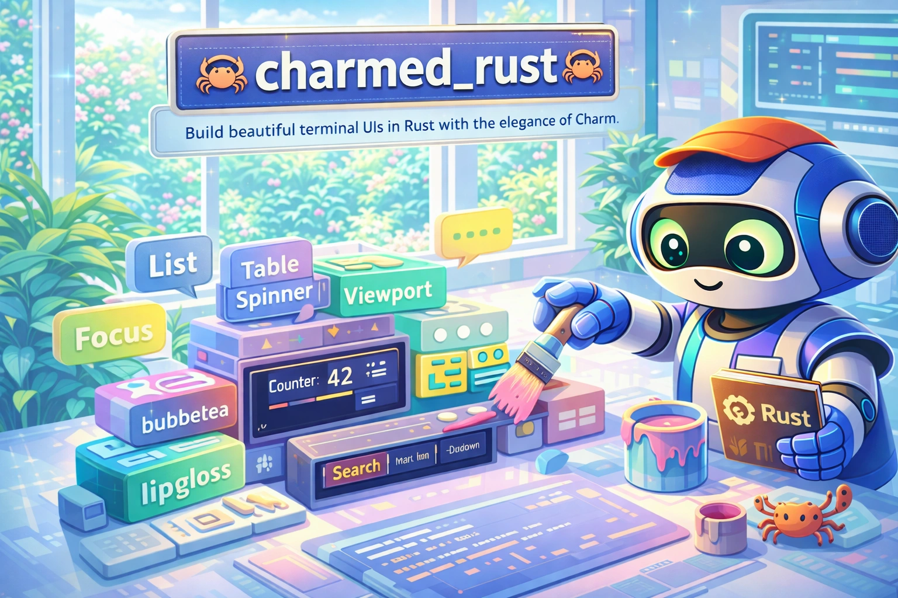

# charmed_rust

<div align="center">
  
</div>

<div align="center">

[](https://github.com/Dicklesworthstone/charmed_rust/actions/workflows/ci.yml)
[](./LICENSE)
[](https://www.rust-lang.org/)
[](https://doc.rust-lang.org/edition-guide/)
[](https://github.com/rust-secure-code/safety-dance/)

**Build beautiful terminal UIs in Rust with Charm's elegance.**

[Quick Start](#quick-start) • [Components](#bubbles-components) • [Styling](#lipgloss-styling-examples) • [SSH Apps](#wish-ssh-framework) • [FAQ](#faq)

</div>

---

```toml
# Add to Cargo.toml
[dependencies]
bubbletea = { package = "charmed-bubbletea", version = "0.1.2" }
lipgloss = { package = "charmed-lipgloss", version = "0.1.2" }
bubbles = { package = "charmed-bubbles", version = "0.1.2" }
```

Crates are published under the `charmed-*` package names on crates.io, while the Rust
crate names remain `bubbletea`, `lipgloss`, `bubbles`, etc. Use `package = "charmed-…"`
to keep the idiomatic crate names in your code.

---

## TL;DR

**The Problem:** Building terminal UIs in Rust means fighting raw ANSI codes, wrestling with complex ncurses bindings, or cobbling together half-finished abstractions. Go developers get [Charm's](https://charm.sh) elegant ecosystem—beautiful styles, functional architecture, polished components—while Rust developers suffer.

**The Solution:** `charmed_rust` ports the entire Charm ecosystem to Rust. Same elegant APIs. Same beautiful output. Rust's type safety, zero-cost abstractions, and fearless concurrency.

### Why charmed_rust?

| Feature | What You Get |
|---------|--------------|
| **Elm Architecture** | Pure `update` and `view` functions. Testable. Predictable. No spaghetti. |
| **CSS-like Styling** | Borders, colors, padding, margins, alignment—`lipgloss` feels like CSS for terminals |
| **16 Components** | Text inputs, lists, tables, spinners, viewports, file pickers—all ready to use |
| **Spring Animations** | `harmonica` gives you physics-based motion: springs, projectiles, smooth easing |
| **Markdown in Terminal** | `glamour` renders beautiful Markdown with syntax highlighting and themes |
| **SSH App Framework** | `wish` serves TUI apps over SSH with middleware patterns—build BBS-style apps |
| **100% Safe Rust** | `#![forbid(unsafe_code)]` everywhere. No segfaults. No data races. Ever. |

---

## Quick Example

```rust
use bubbletea::{Program, Model, Message, Cmd, KeyMsg, KeyCode};
use lipgloss::Style;

struct Counter { count: i32 }

impl Model for Counter {
    fn update(&mut self, msg: Message) -> Cmd {
        if let Some(key) = msg.downcast_ref::<KeyMsg>() {
            match key.code {
                KeyCode::Char('+') => self.count += 1,
                KeyCode::Char('-') => self.count -= 1,
                KeyCode::Char('q') => return Cmd::quit(),
                _ => {}
            }
        }
        Cmd::none()
    }

    fn view(&self) -> String {
        Style::new()
            .bold(true)
            .foreground("#FF69B4")
            .padding(1, 4)
            .render(&format!("Count: {}", self.count))
    }
}

fn main() {
    Program::new(Counter { count: 0 }).run().unwrap();
}
```

**Output:**
```
╭────────────────╮
│  Count: 42     │
╰────────────────╯
```

Press `+` to increment, `-` to decrement, `q` to quit. That's it.

---

## Architecture

```
┌────────────────────────────────────────────────────────────┐
│                       Applications                         │
│  glow (Markdown Reader)    huh (Interactive Forms)         │
└────────────────────────────────────────────────────────────┘
                             │
         ┌───────────────────┼───────────────────┐
         ▼                   ▼                   ▼
┌──────────────────┐ ┌──────────────────┐ ┌──────────────────┐
│     bubbles      │ │     glamour      │ │      wish        │
│ (TUI Components) │ │   (Markdown)     │ │ (SSH Framework)  │
│  - textinput     │ │   - themes       │ │  - middleware    │
│  - list, table   │ │   - word wrap    │ │  - sessions      │
│  - viewport      │ │   - syntax       │ │  - PTY support   │
│  - spinner       │ │                  │ │                  │
│  - filepicker    │ │                  │ │                  │
└──────────────────┘ └──────────────────┘ └──────────────────┘
         │                   │                   │
         └───────────────────┼───────────────────┘
                             ▼
┌────────────────────────────────────────────────────────────┐
│                       bubbletea                            │
│           (Elm Architecture TUI Framework)                 │
│  Model trait • Message passing • Commands • Event loop     │
└────────────────────────────────────────────────────────────┘
                             │
         ┌───────────────────┼───────────────────┐
         ▼                   ▼                   ▼
┌──────────────────┐ ┌──────────────────┐ ┌──────────────────┐
│     lipgloss     │ │    harmonica     │ │   charmed_log    │
│  (Terminal CSS)  │ │   (Animations)   │ │    (Logging)     │
│   - colors       │ │ - spring physics │ │   - text/json    │
│   - borders      │ │ - projectile     │ │ - styled output  │
│   - layout       │ │ - frame timing   │ │   - levels       │
└──────────────────┘ └──────────────────┘ └──────────────────┘
                             │
                             ▼
                    ┌──────────────────┐
                    │    crossterm     │
                    │  (Terminal I/O)  │
                    └──────────────────┘
```

### Crate Reference

| Crate | Purpose | LOC |
|-------|---------|-----|
| **bubbletea** | Elm Architecture TUI framework | ~2,300 |
| **lipgloss** | Terminal styling (colors, borders, padding, alignment) | ~3,000 |
| **bubbles** | 16 pre-built TUI components | ~8,200 |
| **glamour** | Markdown rendering with themes | ~1,600 |
| **harmonica** | Spring physics animations, projectile motion | ~1,100 |
| **wish** | SSH application framework | ~1,700 |
| **huh** | Interactive forms and prompts | ~2,700 |
| **charmed_log** | Structured logging with styled output | ~1,000 |
| **glow** | Markdown reader CLI | ~160 |

### Crates.io Package Names

Crates are published with a `charmed-` prefix on crates.io to avoid name
collisions, while the Rust crate names remain the same:

| Rust Crate | crates.io Package |
|------------|-------------------|
| `bubbletea` | `charmed-bubbletea` |
| `bubbletea_macros` | `charmed-bubbletea-macros` |
| `lipgloss` | `charmed-lipgloss` |
| `harmonica` | `charmed-harmonica` |
| `glamour` | `charmed-glamour` |
| `bubbles` | `charmed-bubbles` |
| `huh` | `charmed-huh` |
| `wish` | `charmed-wish` |
| `charmed_log` | `charmed-log` |
| `glow` | `charmed-glow` |
| `demo_showcase` | `charmed-demo-showcase` |
| `charmed_wasm` | `charmed-wasm` |

---

## Design Philosophy

### 1. Functional Core, Imperative Shell

The Elm Architecture keeps your logic pure:

```rust
// Pure: state + message → new state + effects
fn update(&mut self, msg: Message) -> Cmd {
    match msg.downcast_ref::<KeyMsg>() {
        Some(key) if key.code == KeyCode::Enter => {
            self.submitted = true;
            Cmd::quit()  // Effect described, not executed
        }
        _ => Cmd::none()
    }
}

// Pure: state → string
fn view(&self) -> String {
    format!("Value: {}", self.value)  // No I/O, just render
}
```

Side effects happen through `Cmd` values. Your business logic stays testable.

### 2. Composition Over Inheritance

Components are Models. Nest them freely:

```rust
struct App {
    input: TextInput,     // Handles text entry
    suggestions: List,    // Shows autocomplete
    spinner: Spinner,     // Loading indicator
}

impl Model for App {
    fn update(&mut self, msg: Message) -> Cmd {
        // Delegate to children, compose results
        let cmd1 = self.input.update(msg.clone());
        let cmd2 = self.suggestions.update(msg);
        Cmd::batch(vec![cmd1, cmd2])
    }
}
```

### 3. CSS-like Styling

If you know CSS, you know `lipgloss`:

```rust
let card = Style::new()
    .border(Border::rounded())     // border-radius
    .border_foreground("#7D56F4")  // border-color
    .padding(1, 2)                 // padding: 1em 2em
    .margin(1)                     // margin: 1em
    .width(40)                     // width: 40ch
    .align(Position::Center);      // text-align: center
```

### 4. Zero Unsafe Code

Every crate: `#![forbid(unsafe_code)]`. Memory safety isn't optional.

### 5. Go Conformance

Same inputs → same outputs as Go Charm. Migration is seamless. Conformance tests verify compatibility.

---

## Comparison

| Feature | charmed_rust | Go Charm | ratatui | ncurses-rs |
|---------|--------------|----------|---------|------------|
| **Architecture** | Elm (functional) | Elm (functional) | Immediate mode | Imperative |
| **Styling** | CSS-like | CSS-like | Widget props | Raw attrs |
| **Type Safety** | Compile-time | Runtime | Compile-time | Minimal |
| **Async** | Native tokio | Goroutines | Manual | None |
| **Memory Safety** | Guaranteed | GC | Depends | Unsafe |
| **Components** | 16 included | 16 included | 20+ | Manual |
| **SSH Framework** | ✅ | ✅ | ❌ | ❌ |
| **Markdown** | ✅ | ✅ | ❌ | ❌ |
| **Learning Curve** | Moderate | Moderate | Steep | Steep |

**Choose charmed_rust when:**
- You want Go Charm's elegance with Rust's performance and safety
- You're porting a Go Charm app to Rust
- You prefer functional/Elm-style over immediate mode
- You need SSH-served TUIs

**Consider alternatives when:**
- You need maximum widget variety (ratatui has more)
- You prefer immediate-mode rendering
- You need ncurses compatibility for legacy systems

---

## Installation

### From crates.io (Recommended)

```toml
# Cargo.toml
[dependencies]
bubbletea = { package = "charmed-bubbletea", version = "0.1.2" }
lipgloss = { package = "charmed-lipgloss", version = "0.1.2" }
bubbles = { package = "charmed-bubbles", version = "0.1.2" }
glamour = { package = "charmed-glamour", version = "0.1.2" }
harmonica = { package = "charmed-harmonica", version = "0.1.2" }
wish = { package = "charmed-wish", version = "0.1.2" }
huh = { package = "charmed-huh", version = "0.1.2" }
charmed_log = { package = "charmed-log", version = "0.1.2" }
```

### From Git (Bleeding Edge)

```toml
# Cargo.toml
[dependencies]
bubbletea = { package = "charmed-bubbletea", git = "https://github.com/Dicklesworthstone/charmed_rust" }
lipgloss = { package = "charmed-lipgloss", git = "https://github.com/Dicklesworthstone/charmed_rust" }
bubbles = { package = "charmed-bubbles", git = "https://github.com/Dicklesworthstone/charmed_rust" }
glamour = { package = "charmed-glamour", git = "https://github.com/Dicklesworthstone/charmed_rust" }
harmonica = { package = "charmed-harmonica", git = "https://github.com/Dicklesworthstone/charmed_rust" }
wish = { package = "charmed-wish", git = "https://github.com/Dicklesworthstone/charmed_rust" }
huh = { package = "charmed-huh", git = "https://github.com/Dicklesworthstone/charmed_rust" }
charmed_log = { package = "charmed-log", git = "https://github.com/Dicklesworthstone/charmed_rust" }
```

### With Async Support

```toml
bubbletea = { package = "charmed-bubbletea", version = "0.1.2", features = ["async"] }
tokio = { version = "1", features = ["rt-multi-thread", "macros"] }
```

### From Source

```bash
git clone https://github.com/Dicklesworthstone/charmed_rust.git
cd charmed_rust
cargo build --release

# Run the Markdown reader
cargo run -p charmed-glow -- README.md
```

### Requirements

- **Rust 1.85+** (nightly required for Edition 2024)
- **Platforms:** Linux, macOS, Windows

---

## Quick Start

### 1. Create Project

```bash
cargo new my-tui && cd my-tui
```

### 2. Add Dependencies

```toml
[dependencies]
bubbletea = { package = "charmed-bubbletea", version = "0.1.2" }
lipgloss = { package = "charmed-lipgloss", version = "0.1.2" }
```

### 3. Implement Model

```rust
use bubbletea::{Program, Model, Message, Cmd, KeyMsg, KeyCode};
use lipgloss::Style;

#[derive(Default)]
struct App {
    choice: usize,
    items: Vec<&'static str>,
}

impl Model for App {
    fn init(&mut self) -> Cmd {
        self.items = vec!["Start Game", "Options", "Quit"];
        Cmd::none()
    }

    fn update(&mut self, msg: Message) -> Cmd {
        if let Some(key) = msg.downcast_ref::<KeyMsg>() {
            match key.code {
                KeyCode::Up | KeyCode::Char('k') => {
                    self.choice = self.choice.saturating_sub(1);
                }
                KeyCode::Down | KeyCode::Char('j') => {
                    if self.choice < self.items.len() - 1 {
                        self.choice += 1;
                    }
                }
                KeyCode::Enter | KeyCode::Char('q') => return Cmd::quit(),
                _ => {}
            }
        }
        Cmd::none()
    }

    fn view(&self) -> String {
        let title = Style::new().bold(true).render("Main Menu\n\n");
        let items: String = self.items.iter().enumerate()
            .map(|(i, item)| {
                if i == self.choice {
                    Style::new().foreground("#FF69B4").render(&format!("> {item}\n"))
                } else {
                    format!("  {item}\n")
                }
            })
            .collect();
        format!("{title}{items}\n↑/↓ to move • enter to select • q to quit")
    }
}

fn main() {
    Program::new(App::default()).run().unwrap();
}
```

### 4. Run

```bash
cargo run
```

---

## lipgloss Styling Examples

### Text Styling

```rust
use lipgloss::{Style, Color};

// Bold pink text
let heading = Style::new().bold(true).foreground("#FF69B4");
println!("{}", heading.render("Hello, Terminal!"));

// Underlined with background
let highlight = Style::new()
    .underline(true)
    .background("#333333")
    .foreground("#FFFFFF");
```

### Boxes and Borders

```rust
use lipgloss::{Style, Border};

let card = Style::new()
    .border(Border::rounded())
    .border_foreground("#7D56F4")
    .padding(1, 4)
    .margin(1);

println!("{}", card.render("Content in a card"));
```

**Output:**
```
 ╭────────────────────╮
 │                    │
 │  Content in a card │
 │                    │
 ╰────────────────────╯
```

### Adaptive Colors

```rust
// Automatically picks color based on terminal background
let adaptive = Style::new()
    .foreground(Color::adaptive("#000000", "#FFFFFF"));  // dark bg, light bg
```

### Layout

```rust
use lipgloss::{Style, Position, join_horizontal, join_vertical, place};

// Side-by-side columns
let left = Style::new().width(30).render("Left Panel");
let right = Style::new().width(30).render("Right Panel");
let row = join_horizontal(Position::Top, &[&left, &right]);

// Stacked sections
let header = Style::new().bold(true).render("Header");
let body = "Body content";
let layout = join_vertical(Position::Left, &[&header, body]);

// Center content in a box
let centered = place(80, 24, Position::Center, Position::Center, "Centered!");
```

### Theming

lipgloss includes a theming system for consistent colors across your application:

```rust
use lipgloss::{ThemePreset, ThemedStyle, ColorSlot, ThemeContext};
use std::sync::Arc;

// Use a built-in preset
let ctx = Arc::new(ThemeContext::from_preset(ThemePreset::Dracula));

// Create styles that use semantic color slots
let title = ThemedStyle::new(ctx.clone())
    .foreground(ColorSlot::Primary)
    .bold();

let error = ThemedStyle::new(ctx.clone())
    .foreground(ColorSlot::Error);

println!("{}", title.render("Welcome!"));
println!("{}", error.render("Something went wrong"));

// Switch themes at runtime - styles update automatically
ctx.set_preset(ThemePreset::Nord);
```

**Built-in Themes:**
- `Dark` / `Light` - Default themes
- `Dracula` - Popular purple-tinted dark theme
- `Nord` - Arctic-inspired palette
- `Catppuccin` - Pastel themes (Latte, Frappe, Macchiato, Mocha)

**Semantic Color Slots:**

| Slot | Purpose |
|------|---------|
| `Background` | Main background |
| `Foreground` | Default text |
| `Primary` | Buttons, links, headings |
| `Error` | Error messages |
| `Success` | Confirmations |
| `Warning` | Alerts |
| `Muted` | Disabled/placeholder text |
| `Border` | UI borders |

Load custom themes from files:

```rust
use lipgloss::Theme;

// From TOML, JSON, or YAML
let theme = Theme::from_file("~/.config/myapp/theme.toml")?;

// Validate accessibility
if !theme.check_contrast_aa(ColorSlot::Foreground, ColorSlot::Background) {
    eprintln!("Warning: Poor contrast ratio");
}
```

See [Theming Tutorial](docs/theming-tutorial.md) for complete documentation.

---

## bubbles Components

### TextInput

```rust
use bubbles::textinput::TextInput;

let mut input = TextInput::new();
input.set_placeholder("Enter your name...");
input.set_char_limit(50);
input.set_width(40);
input.focus();

// In update():
input.update(msg);

// In view():
input.view()
```

### List with Filtering

```rust
use bubbles::list::{List, Item};

let items = vec![
    Item::new("Rust", "Systems programming language"),
    Item::new("Go", "Simple, reliable, efficient"),
    Item::new("Python", "Readable and versatile"),
];

let mut list = List::new(items, 10, 40);
list.set_show_filter(true);  // Enable fuzzy search
```

### Table

```rust
use bubbles::table::{Table, Column};

let table = Table::new()
    .columns(vec![
        Column::new("Name", 20),
        Column::new("Status", 10),
        Column::new("CPU", 8),
    ])
    .rows(vec![
        vec!["web-server", "Running", "12%"],
        vec!["database", "Running", "45%"],
        vec!["cache", "Stopped", "0%"],
    ])
    .focused(true);
```

### Spinner

```rust
use bubbles::spinner::{Spinner, SpinnerType};
use lipgloss::Style;

let spinner = Spinner::new()
    .spinner_type(SpinnerType::Dots)
    .style(Style::new().foreground("#FF69B4"));

// Tick it in update() with a timer message
```

### Progress Bar

```rust
use bubbles::progress::Progress;

let progress = Progress::new()
    .width(40)
    .show_percentage(true);

progress.view_as(0.75)  // 75% complete
```

### Viewport (Scrollable)

```rust
use bubbles::viewport::Viewport;

let mut viewport = Viewport::new(80, 24);
viewport.set_content(long_markdown_text);

// Scroll with:
viewport.line_down(1);
viewport.line_up(1);
viewport.half_page_down();
viewport.goto_top();
```

### File Picker

```rust
use bubbles::filepicker::FilePicker;

let mut picker = FilePicker::new();
picker.set_current_directory("/home/user");
picker.set_show_hidden(false);
picker.set_allowed_types(vec!["rs", "toml", "md"]);
```

### Stopwatch & Timer

```rust
use bubbles::stopwatch::Stopwatch;
use bubbles::timer::Timer;
use std::time::Duration;

let stopwatch = Stopwatch::new();  // Counts up
let timer = Timer::new(Duration::from_secs(300));  // 5-minute countdown
```

### Paginator

```rust
use bubbles::paginator::Paginator;

let mut paginator = Paginator::new();
paginator.set_total_pages(10);
paginator.set_per_page(25);
```

---

## glamour Markdown Rendering

```rust
use glamour::{render, Theme};

let markdown = r#"
# Hello World

This is **bold** and *italic* text.

```rust
fn main() {
    println!("Code blocks work too!");
}
```

- Lists
- Are
- Supported
"#;

// Render with default theme
let output = render(markdown)?;
println!("{}", output);

// Or with a specific theme
let themed = glamour::render_with_theme(markdown, Theme::dark())?;
```

### Available Themes

- `Theme::dark()` - For dark terminal backgrounds
- `Theme::light()` - For light terminal backgrounds
- `Theme::dracula()` - Dracula color scheme
- `Theme::ascii()` - Plain ASCII, no colors
- `Theme::notty()` - No formatting (for piping)

---

## wish SSH Framework

Build SSH-accessible TUI applications:

```rust
use wish::{Server, Session, Handler};
use bubbletea::{Program, Model};

struct MyApp { /* ... */ }
impl Model for MyApp { /* ... */ }

struct MyHandler;

impl Handler for MyHandler {
    fn handle(&self, session: Session) {
        // Each SSH connection gets its own TUI instance
        let app = MyApp::new();
        Program::new(app)
            .with_input(session.stdin())
            .with_output(session.stdout())
            .run()
            .unwrap();
    }
}

fn main() {
    Server::new()
        .address("0.0.0.0:2222")
        .host_key_path("./host_key")
        .handler(MyHandler)
        .run()
        .unwrap();
}
```

Users connect with: `ssh -p 2222 localhost`

---

## Async Support

Enable tokio-based async for non-blocking I/O:

```toml
[dependencies]
bubbletea = { package = "charmed-bubbletea", version = "0.1.2", features = ["async"] }
tokio = { version = "1", features = ["rt-multi-thread", "macros"] }
```

```rust
use bubbletea::{Program, Model, Message, AsyncCmd, tick_async};
use std::time::Duration;

struct App {
    data: Option<String>,
    loading: bool,
}

// Async command for HTTP fetch
fn fetch_data() -> AsyncCmd {
    AsyncCmd::new(|| async {
        let resp = reqwest::get("https://api.example.com/data")
            .await.unwrap()
            .text()
            .await.unwrap();
        Message::new(DataLoaded(resp))
    })
}

// Async timer (non-blocking)
fn tick() -> AsyncCmd {
    tick_async(Duration::from_millis(100), |_| Message::new(Tick))
}

impl Model for App {
    fn init(&mut self) -> Cmd {
        self.loading = true;
        fetch_data().into()  // Start fetch on init
    }

    fn update(&mut self, msg: Message) -> Cmd {
        if let Some(DataLoaded(data)) = msg.downcast_ref() {
            self.data = Some(data.clone());
            self.loading = false;
        }
        Cmd::none()
    }
}

#[tokio::main]
async fn main() {
    Program::new(App::default()).run_async().await.unwrap();
}
```

---

## Demo Showcase

The flagship demo shows off all functionality in charmed_rust:

```bash
cargo run -p charmed-demo-showcase
```

### Options

| Flag | Description |
|------|-------------|
| `--theme <name>` | Color theme: `dark`, `light`, `dracula`, `nord`, `catppuccin-*` |
| `--seed <n>` | Seed for reproducible randomness |
| `--no-alt-screen` | Stay in main terminal buffer |
| `--no-mouse` | Disable mouse support |
| `--help` | Show all available options |

### Examples

```bash
# Run with Nord theme
cargo run -p charmed-demo-showcase -- --theme nord

# Run with Dracula theme
cargo run -p charmed-demo-showcase -- --theme dracula

# Reproducible demo state
cargo run -p charmed-demo-showcase -- --seed 42
```

### What It Demonstrates

- **Multi-page navigation** - Dashboard, Services, Jobs, Logs, Docs, Files, Wizard, Settings
- **Theme switching** - Switch themes at runtime with keyboard shortcuts
- **All bubbles components** - Lists, tables, spinners, progress bars, text inputs, viewports
- **Markdown rendering** - glamour with syntax highlighting
- **Form interactions** - Interactive forms via huh
- **Spring animations** - Smooth physics-based animations via harmonica
- **File browser** - Navigate the filesystem
- **Full keyboard & mouse support**

---

## glow CLI Reference

`glow` is a terminal Markdown reader built on `glamour`:

```bash
# Read a file
cargo run -p charmed-glow -- README.md

# Read from stdin
cat README.md | cargo run -p charmed-glow

# With specific theme
cargo run -p charmed-glow -- --theme dracula README.md

# Pager mode (for long documents)
cargo run -p charmed-glow -- --pager README.md
```

### Options

| Flag | Description |
|------|-------------|
| `--theme <name>` | Color theme: `dark`, `light`, `dracula`, `ascii` |
| `--pager` | Enable scrollable pager mode |
| `--width <n>` | Set render width (default: terminal width) |
| `--style <path>` | Load custom style JSON |

---

## Configuration

### Environment Variables

| Variable | Description | Default |
|----------|-------------|---------|
| `COLORTERM` | Color support (`truecolor`, `256`) | auto-detect |
| `NO_COLOR` | Disable all colors if set | unset |
| `GLAMOUR_STYLE` | Default glamour theme | `dark` |
| `TERM` | Terminal type | auto-detect |

### Programmatic Configuration

```rust
use lipgloss::renderer::{Renderer, ColorProfile};

// Force 256-color mode
let renderer = Renderer::new()
    .color_profile(ColorProfile::ANSI256);

// Disable colors entirely
let renderer = Renderer::new()
    .color_profile(ColorProfile::Ascii);
```

---

## Troubleshooting

### "failed to select a version for `bubbletea`"

Use the published package name and alias it to the `bubbletea` crate:

```toml
# ❌ Wrong
bubbletea = "0.1"

# ✅ Correct
bubbletea = { package = "charmed-bubbletea", version = "0.1.2" }
```

### Terminal not restoring after crash

`bubbletea` uses alternate screen mode. Reset with:

```bash
reset
# or
stty sane
```

### Colors not showing

Check true color support:

```bash
echo $COLORTERM  # Should be "truecolor" or "24bit"
```

Fallback to 256 colors:

```rust
let color = Color::ansi256(205);  // Pink in 256-color palette
```

### "cannot find trait `Model`"

Add the import:

```rust
use bubbletea::Model;
```

### Windows: garbled output

Use Windows Terminal, not cmd.exe. Or enable virtual terminal:

```rust
// crossterm handles this, but needs a modern terminal
```

### Viewport not scrolling

Ensure you're forwarding key messages:

```rust
fn update(&mut self, msg: Message) -> Cmd {
    self.viewport.update(msg);  // Don't forget this!
    Cmd::none()
}
```

### SSH connections rejected

Check host key permissions:

```bash
chmod 600 ./host_key
chmod 644 ./host_key.pub
```

---

## Limitations

### Current State

| Capability | Status | Notes |
|------------|--------|-------|
| **crates.io** | ✅ Published | Install via `charmed-*` packages |
| **Nightly Rust** | Required | Edition 2024 |
| **SSH (wish)** | ✅ Stable | Stability audit complete (see `FEATURE_PARITY.md`) |
| **Mouse drag** | ✅ Supported | Enable mouse motion; terminal support varies |
| **Complex Unicode** | ✅ Go-parity | Grapheme-aware width matches Go; rendering depends on terminal/font |
| **Windows SSH** | ✅ CI covered | Requires OpenSSH client (CI installs it) |

### Not Planned

- **Built-in syntax highlighting**: `glamour` detects code blocks but delegates highlighting to `syntect`
- **GUI rendering**: Terminal only—use `egui` or `iced` for GUI
- **ncurses compatibility**: Clean break from legacy

---

## FAQ

### Why "charmed_rust"?

Charm + Rust = charmed_rust. The TUIs are pretty charming too.

### Can I use lipgloss without bubbletea?

Yes. It's completely standalone:

```rust
use lipgloss::Style;
println!("{}", Style::new().bold(true).render("No TUI needed"));
```

### Is this API-compatible with Go Charm?

Semantically yes. Method names follow Rust conventions (`set_width` vs `Width`), but the patterns are identical.

### How do I test TUI apps?

Use headless mode:

```rust
let model = Program::new(app).without_renderer().run()?;
assert_eq!(model.some_state, expected);
```

Or test update/view directly:

```rust
let mut app = MyApp::default();
app.update(Message::new(KeyMsg { code: KeyCode::Enter, .. }));
assert!(app.view().contains("Expected text"));
```

### Does it work in Docker/CI?

Yes. Use `without_renderer()` or set `TERM=dumb` for non-interactive environments.

### How do I handle window resize?

Subscribe to resize events:

```rust
fn update(&mut self, msg: Message) -> Cmd {
    if let Some(size) = msg.downcast_ref::<WindowSizeMsg>() {
        self.width = size.width;
        self.height = size.height;
    }
    Cmd::none()
}
```

### Can I use custom fonts/icons?

The terminal controls fonts. Use Nerd Fonts for icons:

```rust
let icon = "";  // Nerd Font: nf-fa-folder
```

### How do I debug render issues?

Log the view output:

```rust
fn view(&self) -> String {
    let output = self.render_internal();
    eprintln!("VIEW: {:?}", output);  // Goes to stderr, not screen
    output
}
```

Or use `charmed_log` to file:

```rust
charmed_log::init_file("debug.log")?;
log::debug!("State: {:?}", self);
```

---

## Conformance Testing

Verify behavior matches Go Charm:

```bash
# All conformance tests
cargo test -p charmed_conformance

# Specific crates
cargo test -p charmed_conformance test_harmonica
cargo test -p charmed_conformance test_lipgloss
cargo test -p charmed_conformance test_bubbletea
```

Fixtures captured from Go reference implementations live in `tests/conformance/go_reference/`.

---

## Performance

Benchmarks run on Apple M2:

| Operation | Time |
|-----------|------|
| Style creation | ~50ns |
| Simple render | ~200ns |
| Complex layout (10 boxes) | ~2μs |
| Markdown page render | ~500μs |
| Message dispatch | ~100ns |

Memory: Typical TUI app uses 2-5MB RSS.

Run benchmarks:

```bash
cargo bench -p charmed-bubbletea
cargo bench -p charmed-lipgloss
```

---

## About Contributions

Please don't take this the wrong way, but I do not accept outside contributions for any of my projects. I simply don't have the mental bandwidth to review anything, and it's my name on the thing, so I'm responsible for any problems it causes; thus, the risk-reward is highly asymmetric from my perspective. I'd also have to worry about other "stakeholders," which seems unwise for tools I mostly make for myself for free. Feel free to submit issues, and even PRs if you want to illustrate a proposed fix, but know I won't merge them directly. Instead, I'll have Claude or Codex review submissions via `gh` and independently decide whether and how to address them. Bug reports in particular are welcome. Sorry if this offends, but I want to avoid wasted time and hurt feelings. I understand this isn't in sync with the prevailing open-source ethos that seeks community contributions, but it's the only way I can move at this velocity and keep my sanity.

---

## License

MIT License (with OpenAI/Anthropic Rider) — see [LICENSE](LICENSE) for details.

---

<div align="center">

**Built with Rust. Inspired by [Charm](https://charm.sh).**

</div>
